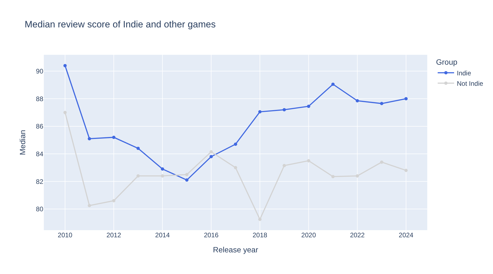
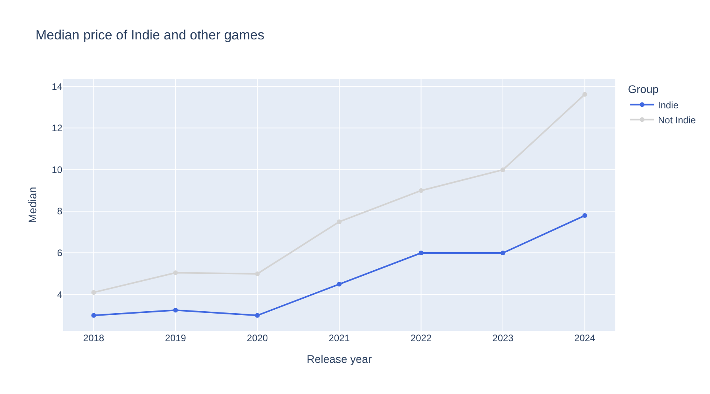

# 14. The Aha Moment

!!! learn "In this lesson we will learn"
    - what makes a good Aha Moment
    - how to make one part of a chart stand out with colour
    - how to add an annotation that points to our finding
    - how to add a slider and a dropdown so our audience can explore

!!! terms "Terminology"
    - **UI element** – a control, such as a slider or dropdown, that our audience can use to change what a notebook shows.
    - **range slider** – a slider with two handles, used to choose a start value and an end value.

## Introduction

Every part of our story so far has been building to this point. The Hook asked the question, Behind the Scenes got the data ready, and Rising Insights collected the evidence. The **Aha Moment** is the one chart where our audience finally sees the answer.

When we planned our own insights, we chose the one that best answers our question. For our example story, it's the line chart of review scores over time: since 2017, Indie games have reviewed better every year. Right now that chart shows the finding, but our audience still has to work it out. In this lesson we'll design it so the finding is impossible to miss, then add controls so our audience can check it for themselves.

A good Aha chart:

1. answers our question in one look
2. uses colour to point at the part that matters, and grey for everything else
3. says the finding in its headline title, and points to it with a note on the chart

## Making one line stand out

In our first line chart, both lines have bright colours, so they both shout for attention. But our story is about Indie games. So let's make the Indie line the only coloured line, and turn the other line grey. The grey line is still there for comparison, but our eyes go straight to the coloured one.

We'll also add an **annotation**: a note on the chart, with an arrow pointing at the exact spot our audience should look. We'll point it at 2018, because that's where the gap jumps to 4 points or more and stays there.

To do both, we'll make the chart the same way as before, then make three changes: `color_discrete_map` sets the colour of each line, `labels` gives the y-axis a name our audience understands, and `add_annotation` adds the arrow. We store the chart in `aha_chart` first, because we can only add an annotation to a chart we've stored. Start marimo with `marimo edit steam_story.py` and press ++ctrl+shift+r++ (++cmd+shift+r++ on a Mac) to run our earlier cells. Add a new cell at the bottom, type the code below and run it.

```python linenums="1" title="steam_story.py — new cell"
--8<-- "examples/aha/14_aha_moment/story18.py"
```

!!! primm "PRIMM"
    1. **Predict** what you think will happen when we run the cell. Be specific.
    2. **Run** the cell.
    3. Time to **investigate** the code. What does each line do?
    4. Time to **modify** the code. Change `"royalblue"` to another colour name, such as `"darkorange"`. Then change `ax` and `ay` to move the annotation's text to a clearer spot.

??? note "Code explanation"
    - **line 1** → starts a line chart and stores it in `aha_chart`, so we can add to it before we show it.
    - **line 2** → uses `per_year_group`, the table of medians for each group in each year, as the data.
    - **line 3** → puts the years along the x-axis.
    - **line 4** → uses the median review score for the y-axis.
    - **line 5** → draws a separate line for each group.
    - **line 6** → chooses the colour of each group's line, using `color_discrete_map`: royal blue for Indie and light grey for every other game.
    - **line 7** → draws a dot on each year, as well as the line.
    - **line 8** → removes the x-axis label, because the years explain themselves, and gives the y-axis a label our audience understands.
    - **line 9** → sets a headline title that states the finding.
    - **line 10** → closes the brackets.
    - **line 11** → starts adding an annotation to `aha_chart`, using `add_annotation`.
    - **line 12** → points the annotation's arrow at the year 2018.
    - **line 13** → points the arrow at a median review score of 87.05, which is where the Indie line is in 2018.
    - **line 14** → sets the text of the annotation.
    - **line 15** → puts the text 120 pixels to the left of the point, using `ax`.
    - **line 16** → puts the text 40 pixels above the point, using `ay`. Negative values move the text up.
    - **line 17** → closes the brackets.
    - **line 18** → shows `aha_chart` as the cell's output.


Compare this with our first line chart. It's the same data, but now our eyes go to the blue line first, the title tells us what it shows, and the arrow shows us where it starts. Our audience doesn't have to work anything out.

!!! tip "Where did 87.05 come from?"
    We found it in the `per_year_group` table: it's the median review score of the Indie games from 2018. We can also hover over the 2018 point on the chart to see it. An annotation's `x` and `y` use the same values as the chart's axes, so the arrow always points at the right spot.

!!! tip "One colour, one message"
    Colour is the first thing our eyes notice, so it's best to use it for one thing only. If every line is bright, nothing stands out. Grey keeps the other lines on the chart for comparison, without pulling our attention away from the story.

## Letting our audience explore

Our Aha chart shows the finding we chose. But a curious audience might ask: "Does it still hold if I only look at recent years?" or "What about prices?" Instead of drawing a chart for every question, we can give them **controls** and let them explore.

marimo calls these controls **UI elements**: sliders, dropdowns, buttons and text boxes that the audience can use to change what the notebook shows. They're part of the `marimo` library, so first we need to import it. Go to the **first** cell, the one with our imports, and change it to match the code below. Then run it.

```python linenums="1" title="steam_story.py — change first cell" hl_lines="1"
--8<-- "examples/aha/14_aha_moment/story01.py"
```

??? note "Code explanation"
    - **line 1** → imports the `marimo` library with the short name `mo`, so we can use its UI elements.

### Creating the controls

We'll give our audience two controls:

- a **range slider** to choose which years to show. A range slider has two handles, so it chooses a start year and an end year. That lets our audience check whether the gap still holds if they only look at recent years.
- a **dropdown** to choose what to compare: review scores or prices. A dropdown lets the audience choose one option from a list. Each option is the name of a column in `scored`, so we can use the chosen option straight in our Polars code.

Every UI element has a `value`, which is whatever the audience has chosen right now. For our slider, `years.value` is a list of two years, such as `[2010, 2024]`. For our dropdown, `measure.value` is the chosen option, such as `"Review score"`.

There's one marimo rule we need to plan around: **a cell can't use the `value` of a UI element that it creates**. marimo needs to know which cells to re-run when the audience moves a control, so the control has to be made in one cell and used in another. So we'll create both controls together in one cell, without showing them, and then show them in the cell that uses them. That way the controls end up sitting right above the chart they change.

Add a new cell at the bottom, type the code below and run it.

```python linenums="1" title="steam_story.py — new cell"
--8<-- "examples/aha/14_aha_moment/story19.py"
```

??? note "Code explanation"
    - **line 1** → creates a range slider, using `mo.ui.range_slider`, and stores it in `years`.
    - **line 2** → sets the lowest value on the slider to 2010.
    - **line 3** → sets the highest value on the slider to 2024.
    - **line 4** → starts with both handles at the ends, so all the years are chosen.
    - **line 5** → puts the label `Years` next to the slider.
    - **line 6** → shows the chosen years next to the slider.
    - **line 7** → closes the brackets.
    - **line 8** → creates a dropdown, using `mo.ui.dropdown`, and stores it in `measure`.
    - **line 9** → sets the options in the list. Each option is the name of a column in `scored`.
    - **line 10** → starts with `Review score` chosen.
    - **line 11** → puts the label `Measure` next to the dropdown.
    - **line 12** → closes the brackets.

Nothing appears under the cell. That's what we want: the last line is part of an assignment, not a value on its own, so the cell has no output. We'll show the controls in the next cell.

### Connecting the controls

Now we'll use the controls. Our Aha chart used `per_year_group`, the median for each group in each year. We'll make the same kind of table, called `explore`, but with two changes: we'll keep only the years between the slider's handles, and we'll find the median of whichever column the dropdown has chosen.

At the end of the cell, we'll show the controls and the table together. `mo.hstack` puts things side by side, so the slider and dropdown sit on one row. `mo.vstack` puts things one under the other, so the controls sit above the table. Add a new cell, type the code below and run it.

```python linenums="1" title="steam_story.py — new cell"
--8<-- "examples/aha/14_aha_moment/story20.py"
```

!!! primm "PRIMM"
    1. **Predict** what you think will happen when we run the cell. Be specific.
    2. **Run** the cell.
    3. Time to **investigate** the code. What does each line do?

??? note "Code explanation"
    - **line 1** → opens a bracket for our code, and will store the result in `explore`.
    - **line 2** → starts filtering the rows of `scored`.
    - **line 3** → keeps only the games released between the slider's two handles. `years.value[0]` is the start year and `years.value[1]` is the end year.
    - **line 4** → closes the `filter` brackets.
    - **line 5** → splits the rows into one group for each year and group, just like `per_year_group`.
    - **line 6** → finds the median of whichever column is chosen in the dropdown, using `measure.value`, and names it `Median`.
    - **line 7** → sorts the table by year, then by group.
    - **line 8** → closes the bracket we opened on line 1.
    - **line 9** → shows the slider and dropdown side by side with `mo.hstack`, and puts them above the `explore` table with `mo.vstack`.

The slider and dropdown appear, with the `explore` table under them. Drag the slider's left handle to 2018. The table changes straight away. Remember from when we explored our data: marimo is **reactive**, so when `years` changes, marimo re-runs every cell that uses it.

!!! tip "Why not show the controls where we made them?"
    If we showed the slider and dropdown in the cell that creates them, our audience would see the controls in one place and the chart they change somewhere else. Showing them in the same cell as the table and chart keeps everything that belongs together in one spot.

Finally, let's chart it. A line chart suits this for the same reason as our Aha chart: years along the bottom and one line per group, so our audience can see whether the gap changes over time. We'll use the same colours as our Aha chart, so Indie is always blue, and build the title from `measure.value`, so it always names the measure that's chosen. We store the chart in `explore_chart` and show it between the controls and the table. Change the cell to match the code below and run it.

```python linenums="1" title="steam_story.py — change existing cell" hl_lines="9-18"
--8<-- "examples/aha/14_aha_moment/story21.py"
```

!!! primm "PRIMM"
    1. **Predict** what you think will happen when we run the cell. Be specific.
    2. **Run** the cell.
    3. Time to **investigate** the code. What does each line do?
    4. Time to **modify** the code. Add `"Recommendations"` to the dropdown's options in the cell that creates the controls. What does the chart show when we choose it?

??? note "Code explanation"
    - **line 9** → starts a line chart and stores it in `explore_chart`.
    - **line 10** → uses `explore` as the data.
    - **line 11** → puts the years along the x-axis.
    - **line 12** → uses the `Median` column for the y-axis.
    - **line 13** → draws a separate line for each group.
    - **line 14** → uses the same colours as our Aha chart, so Indie is always blue.
    - **line 15** → draws a dot on each year.
    - **line 16** → builds the title with an f-string, so it names whichever measure is chosen. `lower` turns the measure's name into lower case.
    - **line 17** → closes the brackets.
    - **line 18** → shows the controls side by side, with the chart under them and the `explore` table under the chart.

The chart appears under the controls, with the `explore` table below it:



<!-- SCREENSHOT: assets/l14_controls.png — the Years slider and Measure dropdown above the explore chart and explore table in marimo -->

Now use the controls. Drag the slider to show 2018 to 2024, then choose **Price** in the dropdown:



Exploring has found something new. Prices of both groups have gone up since 2020, but the other games have gone up faster. In 2024 the typical non-Indie game cost about **US$13.60**, while the typical Indie game cost **US$7.79**. That's a much bigger gap than the $1.15 we found across all years when we summarised our groups. It's a good extra insight for our story.

!!! warning "Explore, then check"
    Controls make it easy to find patterns, and just as easy to find patterns that aren't real. Before we put anything we found by exploring into our story, we check it the same way as our other insights, using the checks in [Our Own Insights](../insights/13_own_insights.md#checking-each-insight): are there enough games in each group, did we use the right average, and is our claim honest?

!!! tip "Two charts, two jobs"
    Our Aha chart and our explore chart do different jobs. The Aha chart is **designed**: we chose its years, colours, title and annotation to tell our audience one thing. The explore chart is for **checking**: it lets our audience ask their own questions. A good data story needs the Aha chart, and the explore chart is a bonus.

## Your data story

Open ***my_data_story.md***, add a new heading `## Aha Moment` and record your answers under it.

1. Redesign the insight you chose under `## My insights` as your Aha chart. Use one colour for the part that matters and grey for the rest, give it a headline title and add an annotation. Write down the title and the annotation's text.
2. Show your Aha chart to someone for five seconds, then ask them what it shows. Did they get your finding straight away? Record what they said, and what you changed.
3. Add at least one UI element that lets your audience explore your data, and show it in the same cell as the table or chart it changes. Write down one thing you found by exploring, and whether it passed the checks in Our Own Insights.
