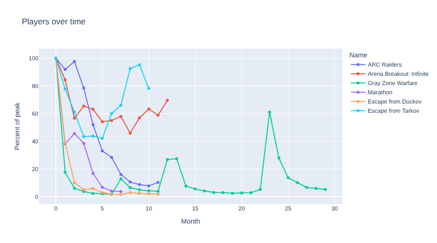
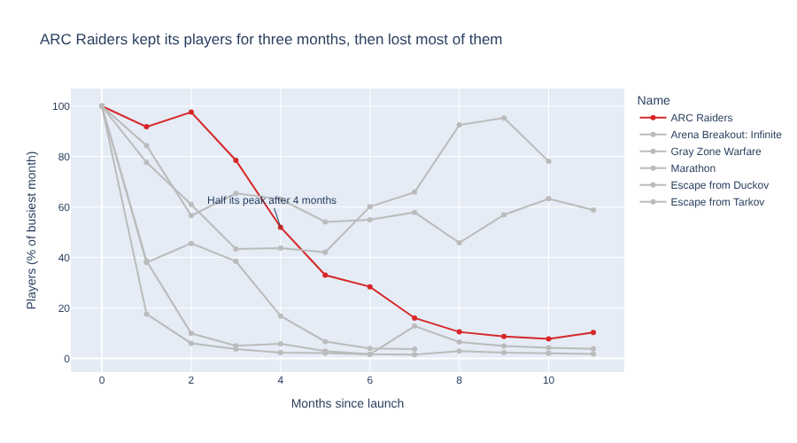
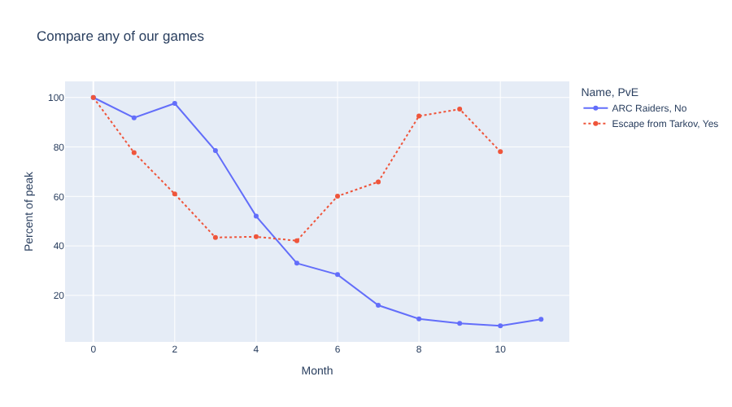

# 15. The Aha Moment

!!! learn "In this lesson we will learn"
    - what makes an Aha Moment chart
    - how to remove clutter from a chart
    - how to use colour to point at the finding
    - how to add clear labels and an annotation
    - how to let our audience explore with marimo's interactive controls

## Introduction

Welcome to the **Aha Moment**: the one chart our whole story builds up to. Nightingale's rose was her Aha Moment. Anyone who looked at it could see, straight away, that disease killed far more soldiers than wounds did.

Our Aha Moment chart needs to do the same for our question. We have the data in `monthly`. In this lesson we'll turn it from a busy chart into one that makes our finding impossible to miss.

## A first attempt

Start marimo with `marimo edit steam_story.py` and press ++ctrl+shift+r++ (++cmd+shift+r++ on a Mac) to run our earlier cells. Add a new cell at the bottom, type the code below and run it.

```python linenums="1" title="steam_story.py"
--8<-- "examples/aha/15_aha_moment/story22.py"
```

!!! primm "PRIMM"
    1. **Predict** what you think will happen when we run the cell. Be specific.
    2. **Run** the cell.
    3. Time to **investigate** the code. What does each line do?

??? note "Code explanation"
    - **line 1** → starts a line chart.
    - **line 2** → uses `monthly` as the data.
    - **line 3** → puts the months since launch along the x-axis.
    - **line 4** → uses `Percent of peak` for the y-axis.
    - **line 5** → draws a separate line, in a different colour, for each game, using `color`.
    - **line 6** → draws a dot on each month.
    - **line 7** → sets the chart's title.
    - **line 8** → closes the brackets.



The data is all there, but what's the message? Our eyes jump around six colours. Gray Zone Warfare stretches out to month 29, squashing everything else to the left. The title, "Players over time", tells us nothing we didn't already know. This chart makes our audience do the work.

Still, it shows us some interesting things:

- every game drops a long way from its peak, often within the first two months
- ARC Raiders stays close to its peak for **three months** before it falls
- Escape from Tarkov and Arena Breakout: Infinite drop, then **climb back**
- Gray Zone Warfare has two big spikes, at months 13 and 23. Spikes like these usually come from a big update or a free weekend.

## Comparing one month

Before we design our chart, let's pin down the numbers. Add a new cell, type the code below and run it.

```python linenums="1" title="steam_story.py"
--8<-- "examples/aha/15_aha_moment/story23.py"
```

!!! primm "PRIMM"
    1. **Predict** what you think will happen when we run the cell. Be specific.
    2. **Run** the cell.
    3. Time to **investigate** the code. What does each line do?
    4. Time to **modify** the code. Change `6` to `3`. How does ARC Raiders compare after three months?

??? note "Code explanation"
    - **line 1** → keeps only month 6 of `monthly`, which is six months after each game's launch.
    - **line 2** → shows just the `Name`, `PvE` and `Percent of peak` columns.
    - **line 3** → sorts the games from highest percent of peak to lowest.

| Name | PvE | Percent of peak |
| :-- | :-- | --: |
| Escape from Tarkov | Yes | 60.1 |
| Arena Breakout: Infinite | Added later | 55.0 |
| ARC Raiders | No | 28.4 |
| Marathon | No | 4.0 |
| Escape from Duckov | Single-player | 1.7 |
| Gray Zone Warfare | Yes | 1.6 |

After six months, ARC Raiders is **in the middle**. Two games kept a much bigger share of their players, and three had lost almost all of theirs. And the two games with a PvE option are at opposite ends of the table: one first, one last.

That's our Aha Moment. ARC Raiders' drop **wasn't unusual**: it held on to its players for longer than most, then fell. And a PvE option **on its own** doesn't explain which games keep their players.

## Designing the Aha chart

Now we'll redraw the chart so it shows that finding. Three ideas will help:

1. **remove clutter**: show only what the message needs. We'll cut every game to its first year, months 0 to 11, so all six fit
2. **use colour to point**: make ARC Raiders bright red, and every other game the same light grey. Grey lines give context without competing for attention
3. **say it in words**: a headline title, clear axis labels, and an **annotation**, a note on the chart pointing at the key moment

Add a new cell, type the code below and run it.

```python linenums="1" title="steam_story.py"
--8<-- "examples/aha/15_aha_moment/story24.py"
```

!!! primm "PRIMM"
    1. **Predict** what you think will happen when we run the cell. Be specific.
    2. **Run** the cell.
    3. Time to **investigate** the code. What does each line do?
    4. Time to **modify** the code. Change the colour of Escape from Tarkov to blue, `"#1F77B4"`, and add a second annotation pointing at its climb back up. What does that add to the story?

??? note "Code explanation"
    - **line 1** → keeps only months 0 to 11 of `monthly`, and stores them in `first_year`.
    - **line 2** → starts a line chart, and will store it in `aha_chart` so we can add to it.
    - **lines 3–7** → use `first_year` as the data, with months along the x-axis, percent of peak up the y-axis, one line per game, and a dot on each month.
    - **lines 8–15** → set each game's colour with `color_discrete_map`: red for ARC Raiders and light grey for every other game. Colours are written as **hex codes**, like `#D62728`.
    - **lines 16–19** → replace the column names on the axes with clearer labels, using `labels`.
    - **line 20** → sets a headline title that states the finding.
    - **line 21** → closes the `px.line` brackets.
    - **lines 22–27** → add an annotation at month 4, 52% of peak, with an arrow pointing to that spot, using `add_annotation`.
    - **line 28** → shows `aha_chart` as the cell's output.



Our eyes go straight to the red line. Before reading a single number, our audience can see that ARC Raiders stayed high while most grey lines crashed, then fell steeply from month 3. The title says it in words, so nobody can miss it.

!!! tip "Colour for everyone"
    About 1 in 12 boys and 1 in 200 girls have some kind of colour blindness, most often finding red and green hard to tell apart. Red against grey works for almost everyone, because the two are very different in brightness as well as colour. Never make red against green the only way to tell two things apart.

## Letting our audience explore

A data story can do something a printed chart can't: let our audience ask their own questions. marimo has **interactive controls**, like menus and sliders, that work with its reactive cells. When someone changes a control, every cell that uses it runs again.

First we need to import marimo itself. Change the first cell to match the code below and run it.

```python linenums="1" title="steam_story.py" hl_lines="4"
--8<-- "examples/aha/15_aha_moment/story01.py"
```

??? note "Code explanation"
    - **line 4** → imports marimo with the short name `mo`, so we can use its interactive controls.

Add a new cell at the bottom, type the code below and run it.

```python linenums="1" title="steam_story.py"
--8<-- "examples/aha/15_aha_moment/story25.py"
```

??? note "Code explanation"
    - **lines 1–5** → make a menu where we can choose several games, using `mo.ui.multiselect`, and store it in `game_picker`. Its options are the names in `story_games`, with ARC Raiders and Escape from Tarkov chosen to start with.
    - **line 6** → makes a slider from 1 to 11 that starts at 11, using `mo.ui.slider`, and stores it in `month_slider`.
    - **line 7** → shows the menu and the slider side by side, using `mo.hstack`.

<!-- SCREENSHOT: assets/l15_controls.png — the multiselect and slider side by side -->

The menu and slider appear, but they don't do anything yet. Add a new cell, type the code below and run it.

```python linenums="1" title="steam_story.py"
--8<-- "examples/aha/15_aha_moment/story26.py"
```

!!! primm "PRIMM"
    1. **Predict** what you think will happen when we run the cell. Be specific.
    2. **Run** the cell.
    3. Time to **investigate** the code. What does each line do?
    4. Now use the controls. Add Gray Zone Warfare to the menu, and drag the slider back to 3. **Predict** what will happen to the chart before you look.

??? note "Code explanation"
    - **line 1** → starts filtering `monthly`, and will store the result in `picked`.
    - **line 2** → keeps only the games chosen in the menu. `game_picker.value` is the list of chosen names.
    - **line 3** → keeps only the months up to the slider's value.
    - **line 4** → closes the `filter` brackets.
    - **lines 5–11** → draw a line chart of `picked`, with one colour per game and a different line style for each PvE option, using `line_dash`.
    - **line 12** → sets the chart's title.
    - **line 13** → closes the brackets.



When we change the menu or the slider, the chart redraws by itself. We didn't write any code to make that happen: the chart's cell uses `game_picker` and `month_slider`, so marimo re-runs it whenever they change, just like `sample_size` in Lesson 2.

!!! warning "The Aha chart comes first"
    Interactive controls are great for exploring, but they don't replace the Aha Moment. If our audience has to find the finding themselves, some of them won't. Show the Aha chart first, with its message, then offer the controls for anyone who wants to dig deeper.

## Our data story

Open ***my_data_story.md***, add a new heading `## Lesson 15: Aha Moment` and record our answers under it.

1. Write our Aha Moment in one sentence. It should answer our question from Lesson 3.
2. Draw our Aha chart. Remove clutter, use colour to point at the finding, and add a headline title, clear labels and at least one annotation. Record the title.
3. Ask someone else to look at our chart for five seconds, then tell us what it shows. Did they get our message? Record what they said, and what we changed because of it.
4. Add one interactive control that lets our audience explore our data.
