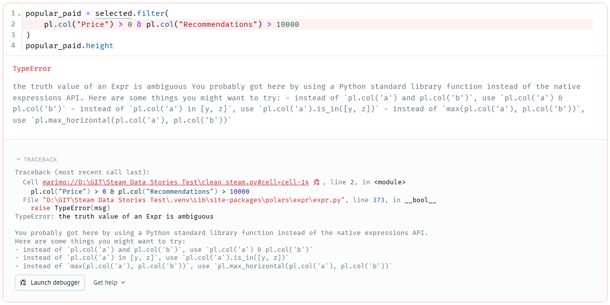
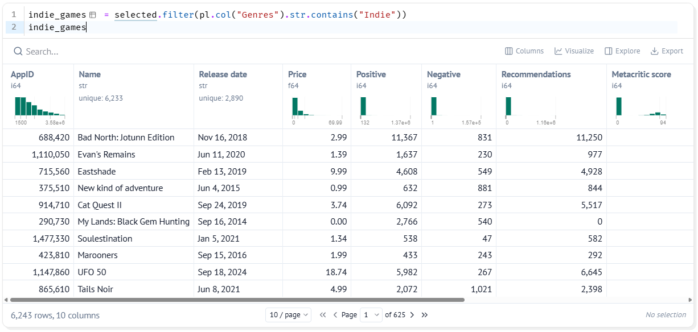

# 5. Choosing Columns and Rows

!!! learn "In this lesson we will learn"
    - why cleaning is the Behind the Scenes stage of our story
    - how to keep only the columns we need with `select`
    - how to keep only the rows we need with `filter`
    - how to combine conditions with `&` and `|`
    - how to find the Indie games

!!! terms "Terminology"
    - **data cleaning** – finding and fixing problems in data so we can trust the results.
    - **expression** – a description of what to do with a column, such as `pl.col("Price") > 0`, which Polars works out for every row at once.

## Introduction

Welcome to **Behind the Scenes**. Our audience will never see this stage of our story, but this is where we earn their trust. If our data is wrong, every chart and every claim in our story is wrong too.

Finding and fixing problems in data so we can trust it is called **data cleaning**. The first job is to cut our data down to what we need. We have 12 columns and 10,250 rows, but our question only needs some of them. Smaller tables are easier to read and easier to check.

## Choosing columns

Let's think about which of our 12 columns our example question needs. Our question is: do Indie games get a higher review score than other games, and do they cost less? Going through the columns one at a time:

- `AppID` → keep. It's the only column that's different for every game, so we'll need it to check for repeated games.
- `Name` → keep, so we can recognise each game.
- `Release date` → keep. We'll want to see whether things change over time.
- `Price` → keep. It answers the "do they cost less?" part of our question.
- `Positive` and `Negative` → keep. We'll calculate each game's review score from them.
- `Recommendations` → keep. It's another way to measure how popular a game is.
- `Metacritic score` → keep, so we can compare critics' scores with players' reviews.
- `Developers` → keep, so we can see who made each game.
- `Genres` → keep. It tells us which games are Indie.
- `Achievements` → leave out. The number of achievements doesn't help answer our question.
- `Publishers` → leave out. We're using `Genres` to decide which games are Indie, so we don't need it.

That leaves 10 columns. We'll use `select` to keep just those, and store the result in a new variable called `selected`.

Start marimo with `marimo edit clean_steam.py` and press ++ctrl+shift+r++ (++cmd+shift+r++ on a Mac) to run our earlier cells. Then add a new cell at the bottom, type the code below and run it.

```python linenums="1" title="clean_steam.py — new cell"
--8<-- "examples/cleaning/05_select_filter/cell13.py"
```

!!! primm "PRIMM"
    1. **Predict** what you think will happen when we run the cell. Be specific.
    2. **Run** the cell.
    3. Time to **investigate** the code. What does each line do?

??? note "Code explanation"
    - **lines 1–12** → use `select` to make a new DataFrame from `public_games` that holds only the 10 columns we list, in the order we list them, and store it in a variable called `selected`.
    - **line 13** → shows `selected` as the cell's output.

The table now has **10** columns instead of 12, and still has all 10,250 rows. `select` never changes the number of rows: it only chooses columns.

!!! tip "Achievements and Publishers might suit your question"
    We left out `Achievements` and `Publishers` because our example question doesn't need them, but they could be just what your own question needs. For example: do games with more achievements get more recommendations? Do games from publishers that release lots of games get better reviews? If your question uses them, add them to your `select` cell.

!!! tip "Building on the last variable"
    We started from `public_games`, the version without support emails that we made when we looked at privacy. Each cleaning step starts from the variable the step before made, and gives its result a new name. That way we can always look back at any earlier version.

## Choosing rows

To keep only some rows, we use `filter` with a condition. Rows where the condition is `True` are kept.

Our question is partly about price, so a good first question is: how many of our games cost money, and how many are free? Free games might behave differently from paid games, so it's worth knowing how many there are. We'll keep only the rows where `Price` is more than 0.

Add a new cell, type the code below and run it.

```python linenums="1" title="clean_steam.py — new cell"
--8<-- "examples/cleaning/05_select_filter/cell14.py"
```

!!! primm "PRIMM"
    1. **Predict** what you think will happen when we run the cell. Be specific.
    2. **Run** the cell.
    3. Time to **investigate** the code. What does each line do?
    4. Time to **modify** the code. Change `> 0` to `== 0` to find the free games instead. How many are there?

??? note "Code explanation"
    - **line 1** → keeps only the rows of `selected` where the `Price` is greater than 0, and stores them in `paid_games`.
    - **line 2** → shows the number of rows in `paid_games`, using `height`.

The output is **8839**: that's how many games cost money. The other 1,411 are free.

`pl.col("Price")` means "the `Price` column". It's called an **expression**: a description of what to do with a column, which Polars works out for every row at once. We'll use `pl.col` in almost every cell from now on.

## Combining conditions

What if we want paid games that are also very popular? We'll say a game is very popular if it has more than 10,000 recommendations. That means a row has to pass two conditions at once: `Price` more than 0 **and** `Recommendations` more than 10,000. Python's symbol for "and" between Polars conditions is `&`.

Add a new cell and type the code below, exactly as it is, then run it.

```python linenums="1" title="clean_steam.py — new cell"
--8<-- "examples/cleaning/05_select_filter/cell15a.py"
```

??? note "Code explanation"
    - **lines 1–3** → try to keep the rows of `selected` that cost more than 0 and have more than 10,000 recommendations.
    - **line 4** → shows the number of rows in `popular_paid`.

Instead of a number, we get an error:



- **TypeError** → the type of error. It means Python tried to use a value in a way its type doesn't allow. Here, it tried to treat an expression as a single `True` or `False`.
- **the truth value of an Expr is ambiguous** → Python couldn't decide whether the expression was `True` or `False`.
- **the highlighted line** → marimo highlights line 2 of our cell, the line that caused the error.
- **the suggestions** → Polars lists some common causes, such as using `and` instead of `&`. Our code already uses `&`, so the cause here is different.

The problem is the order Python works things out. Python does `&` **before** `>`, so it tried to work out `0 & pl.col("Recommendations")` first, which makes no sense. We fix it by putting each condition in its own brackets, so each comparison happens first.

Change the cell to match the code below and run it again.

```python linenums="1" title="clean_steam.py — change existing cell" hl_lines="2"
--8<-- "examples/cleaning/05_select_filter/cell15.py"
```

??? note "Code explanation"
    - **line 2** → puts each condition in its own brackets and joins them with `&`, so a row is kept only if **both** conditions are `True`.

The output is **1315**: only 1,315 paid games have more than 10,000 recommendations.

There are three ways to combine conditions:

| Operator | Meaning | A row is kept when |
| :-- | :-- | :-- |
| `&` | and | both conditions are `True` |
| `|` | or | at least one condition is `True` |
| `~` | not | the condition is `False` |

!!! warning "Use & and |, not and and or"
    In normal Python we write `and` and `or`. Polars expressions need `&` and `|` instead, and each condition needs its own brackets.

!!! primm "PRIMM"
    Time to **modify** the code. Change it to find games that are free **or** have more than 100,000 recommendations. How many are there?

## Finding the Indie games

Our example question compares Indie games with all the other games. When we asked our question, we counted the Indie games with `str.contains`. Now let's keep them as their own DataFrame, so we can look through them and check that our definition of Indie picks the games we expect. We'll use the same `str.contains` condition inside a `filter`.

Add a new cell, type the code below and run it.

```python linenums="1" title="clean_steam.py — new cell"
--8<-- "examples/cleaning/05_select_filter/cell16.py"
```

!!! primm "PRIMM"
    1. **Predict** what you think will happen when we run the cell. Be specific.
    2. **Run** the cell.
    3. Time to **investigate** the code. What does each line do?
    4. Time to **modify** the code. Put `~` in front of `pl.col` to find the games that **aren't** Indie. How many are there?

??? note "Code explanation"
    - **line 1** → keeps only the rows of `selected` whose `Genres` text contains `Indie`, and stores them in `indie_games`.
    - **line 2** → shows `indie_games` as the cell's output.



The table has **6243** rows, which matches our count from when we asked our question. Scroll across to the `Genres` column: every row has `Indie` somewhere in its list of genres.

## Your data story

Open ***my_data_story.md***, add a new heading `## Columns and rows` and record your answers under it.

1. List the columns your question needs, and write down why you need each one. If any of them isn't in `selected`, such as `Achievements` or `Publishers`, add it to the `select` cell. Don't remove any columns, because the next lessons use them.
2. Write a `filter` that finds the rows your question is about, such as games from one genre or one price range. Record the condition and how many rows it keeps.
3. If your question compares two groups, write one `filter` for each group, and record how many rows are in each.
