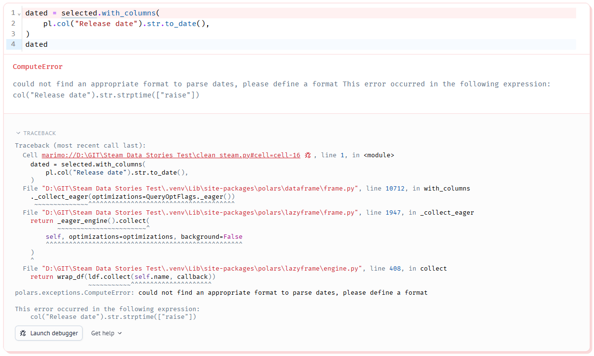
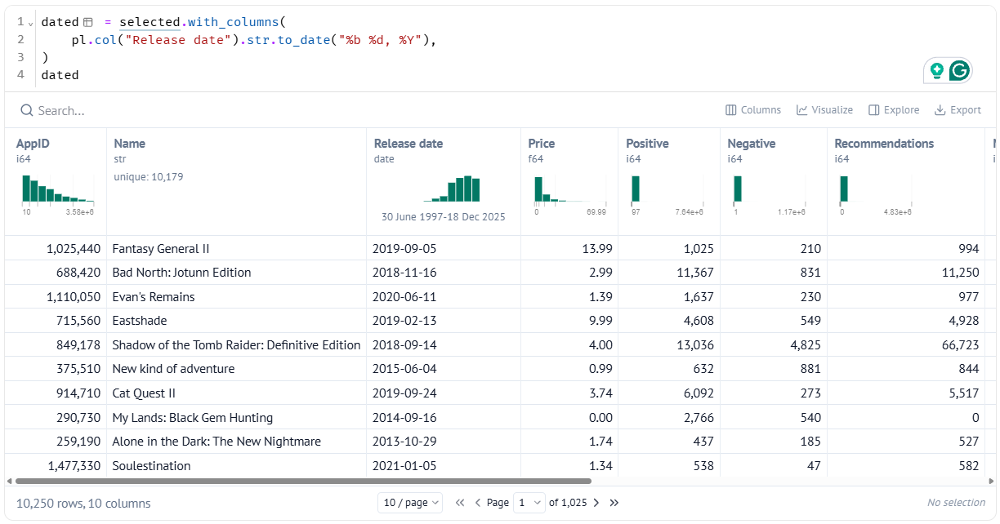
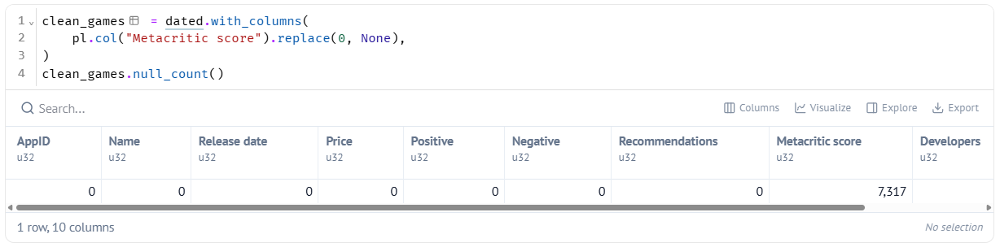
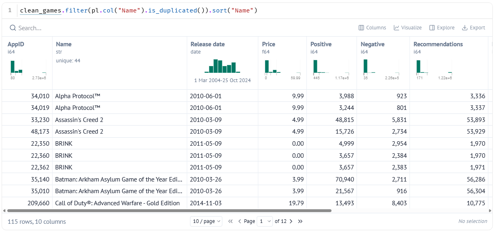

# 6. Fixing Our Data

!!! learn "In this lesson we will learn"
    - how to turn text into dates with `str.to_date`
    - how to turn values that mean "missing" into nulls
    - why we identify games by AppID, not name
    - how to save our clean data

!!! terms "Terminology"
    - **format code** – a pattern such as `%b %d, %Y` that tells Polars how dates are written in text.
    - **Parquet** – a file format for tables that saves each column's data type along with the data.

## Introduction

When we asked a question data can answer, we found two problems in our data. `Release date` holds dates stored as text, so they sort in alphabetical order instead of by date. And most `Metacritic score` values are 0, which really means "no score". In this lesson we'll fix both, check for repeated games, and save our clean data so our story notebook can use it.

## Text into dates

Our story will look at how games have changed over time, so we need `Release date` to behave like a real date. While it's text, Polars can't sort it in date order or pull the year out of it. Polars has a method called `str.to_date` that turns text into dates, so we'll try it on its own first and see whether Polars can work out how our dates are written.

We use `with_columns` because we want to keep every column and change just one. We store the result in a new variable, `dated`, because marimo lets each variable be made in only one cell, and it keeps `selected` unchanged in case we need to go back to it.

Start marimo with `marimo edit clean_steam.py` and press ++ctrl+shift+r++ (++cmd+shift+r++ on a Mac) to run our earlier cells. Add a new cell at the bottom, type the code below and run it.

```python linenums="1" title="clean_steam.py — new cell"
--8<-- "examples/cleaning/06_fixing_data/cell17a.py"
```

??? note "Code explanation"
    - **line 1** → starts making a new version of `selected` with changed columns, using `with_columns`, and will store it in `dated`.
    - **line 2** → tries to turn the text in `Release date` into dates, using `str.to_date`.
    - **line 3** → closes the `with_columns` brackets.
    - **line 4** → shows `dated` as the cell's output.

We get an error:



- **ComputeError** → the type of error. It means Polars couldn't finish a calculation.
- **could not find an appropriate format to parse dates, please define a format** → Polars tried to work out how our dates are written and couldn't, so it's asking us to tell it.
- **This error occurred in the following expression** → shows the part of our code Polars was working on. `str.strptime` is the method `str.to_date` uses behind the scenes, so this points to our `Release date` line.
- **Traceback** → the steps Python went through before the error. The first line points to our cell; the rest are inside Polars, so we can ignore them.

Polars recognises dates written like `2017-02-24`, but ours are written like `Feb 24, 2017`. We describe that pattern with a **format code**:

| Part of the date | Format code | Example |
| :-- | :-- | :-- |
| short month name | `%b` | `Feb` |
| day of the month | `%d` | `24` |
| four-digit year | `%Y` | `2017` |

Everything that isn't a format code, like the space and the comma, has to match the text exactly. So `Feb 24, 2017` has the format `%b %d, %Y`.

Change the cell to match the code below and run it again.

```python linenums="1" title="clean_steam.py — change existing cell" hl_lines="2"
--8<-- "examples/cleaning/06_fixing_data/cell17.py"
```

!!! primm "PRIMM"
    1. **Predict** what you think will happen when we run the cell. Be specific.
    2. **Run** the cell.
    3. Time to **investigate** the code. What does each line do?

??? note "Code explanation"
    - **line 2** → turns the text in `Release date` into dates, using the format `%b %d, %Y`. Because the new column has the same name as the old one, it replaces it.



The `Release date` column now shows dates like `2019-09-05`, and its data type is **date**. Every one of the 10,250 dates converted.

!!! tip "One format for every row"
    `str.to_date` uses the same format for every row. If even one row were written differently, like `24 Feb 2017`, Polars would stop with an error. That's a useful check: it proves every date in our data is written the same way.

Now let's check that the dates sort properly. If they're real dates, the smallest one should be the oldest game and the largest should be the newest. So we'll ask Polars for the `min` and `max` of the column and check they make sense. Add a new cell, type the code below and run it.

```python linenums="1" title="clean_steam.py — new cell"
--8<-- "examples/cleaning/06_fixing_data/cell18.py"
```

??? note "Code explanation"
    - **line 1** → shows the earliest and the latest `Release date` in `dated`, using `min` and `max`.

The output shows **30 June 1997** and **18 December 2025**. When we first looked at the dates as text, the "smallest" was `Apr 1, 1999` and the "largest" was `Sep 9, 2024`. Now they really are the oldest and newest games.

## Values that mean "missing"

Remember from when we looked at privacy and ethics that a **null** means a value is missing. When we asked a question data can answer, we found that 7,317 games have a `Metacritic score` of 0. Metacritic scores go from 1 to 100, so a 0 means the game wasn't reviewed. If we left those 0s in, they'd drag down every average we work out.

Before we change anything, let's think about the other number columns too:

| Column | Is 0 real? | Why |
| :-- | :-- | :-- |
| `Price` | yes | free games really do cost $0 |
| `Recommendations` | yes | a game can really have no recommendations |
| `Metacritic score` | no | scores go from 1 to 100, so 0 means "no score" |

So we only need to fix `Metacritic score`. We'll use `replace` to swap every 0 in that column for `None`, which Polars stores as a null. Then we'll use `null_count` to count the nulls in every column, so we can check that exactly 7,317 values changed and nothing else did. Add a new cell, type the code below and run it.

```python linenums="1" title="clean_steam.py — new cell"
--8<-- "examples/cleaning/06_fixing_data/cell19.py"
```

!!! primm "PRIMM"
    1. **Predict** what you think will happen when we run the cell. Be specific.
    2. **Run** the cell.
    3. Time to **investigate** the code. What does each line do?

??? note "Code explanation"
    - **line 1** → starts making a new version of `dated` with a changed column, and will store it in `clean_games`.
    - **line 2** → replaces every 0 in `Metacritic score` with `None`, which Polars stores as a null.
    - **line 3** → closes the `with_columns` brackets.
    - **line 4** → counts the nulls in every column of `clean_games`.



Every column has 0 nulls, except `Metacritic score`, which now has **7317**. The hidden gaps are now real gaps that Polars knows about.

!!! tip "Why nulls are better than 0s"
    Polars skips nulls when it works out things like `mean` and `median`. So the average `Metacritic score` is now the average of the games that were actually reviewed, instead of being dragged down by thousands of made-up zeros.

!!! warning "Cleaning is a judgement call"
    We decided that 0 means "missing" for `Metacritic score` but not for `Price`. Decisions like this change our results, so good data scientists write them down where others can see them. That's what the **Your data story** section is for.

## Repeated names

When we met the Steam dataset, we said two games can share a name but never an AppID. If some games share a name, we need to know, because any step that picks out a game by its name could pick the wrong one.

To find them, we'll use `is_duplicated`, which marks every row whose `Name` appears more than once. Then we'll sort by `Name` so rows with the same name sit next to each other and we can compare them. Add a new cell, type the code below and run it.

```python linenums="1" title="clean_steam.py — new cell"
--8<-- "examples/cleaning/06_fixing_data/cell20.py"
```

!!! primm "PRIMM"
    1. **Predict** what you think will happen when we run the cell. Be specific.
    2. **Run** the cell.
    3. Time to **investigate** the code. What does each line do?

??? note "Code explanation"
    - **line 1** → keeps only the rows of `clean_games` whose `Name` appears more than once, using `is_duplicated`, then sorts them by `Name` so games with the same name sit together.



**115** rows share their name with another row. Look at the two rows for `Alpha Protocol™`: they have the same release date and developer, but different AppIDs and different numbers of reviews. Some games have more than one page on the Steam store, such as a separate page for a special edition or for players in another region, and each page collects its own reviews.

So these rows aren't mistakes, and we won't delete them. Each one is a real store page with real reviews. Instead, we solve the problem by using **AppID**. `Name` can't tell the two Alpha Protocol rows apart, but their AppIDs, 34010 and 34019, can. From now on, whenever we need to identify one game, we'll use its `AppID`, never its `Name`.

That only works if every AppID really is different, so let's check. We'll use `is_unique`, which marks each row whose `AppID` appears only once, then `all`, which gives back `True` only if every row passed. Add a new cell, type the code below and run it.

```python linenums="1" title="clean_steam.py — new cell"
--8<-- "examples/cleaning/06_fixing_data/cell21.py"
```

??? note "Code explanation"
    - **line 1** → checks whether each value in the `AppID` column appears only once, using `is_unique`, then uses `all` to give back one `True` only if every row passed.

The output is **True**. Every row has its own AppID, so AppID is a safe way to identify a game, even when two games share a name.

!!! tip "Use AppID, not Name"
    If we filtered for `pl.col("Name") == "Alpha Protocol™"`, we'd get two rows and might count the game twice. Filtering for `pl.col("AppID") == 34010` always gives exactly one row. Whenever a later step needs one particular game, use its AppID.

## Saving our clean data

Our cleaning is done. Our story will go in a new notebook, so it needs a copy of `clean_games`. Rather than run every cleaning cell again there, we'll save the result to a file. We'll use a **Parquet** file instead of a CSV, because Parquet remembers each column's data type, so our dates stay dates and our nulls stay nulls. Add a new cell, type the code below and run it.

```python linenums="1" title="clean_steam.py — new cell"
--8<-- "examples/cleaning/06_fixing_data/cell22.py"
```

??? note "Code explanation"
    - **line 1** → saves `clean_games` as a **Parquet** file called ***clean_games.parquet*** in our ***data*** folder.

Check VS Code's Explorer panel: the new file is in our ***data*** folder.

!!! tip "Why Parquet and not CSV?"
    A **Parquet** file stores each column's data type along with the data. When we load it again, our dates are still dates and our nulls are still nulls, so we don't have to fix them a second time.

!!! warning "Re-run the saving cell after changes"
    If we change any cleaning cell later, the Parquet file won't update by itself. Run the saving cell again so our story notebook gets the new version.

## Your data story

Open ***my_data_story.md***, add a new heading `## Clean data` and record your answers under it.

1. For each column your question needs, write down whether 0 is a real value or means "missing", and why.
2. Write down every cleaning decision made while cleaning the data, from removing the support emails to saving the Parquet file, and why. Start each one with "I decided…". This becomes the "How I got my data" part of your finished story.
3. Write down one thing about the data that your audience should know, because it limits what you can claim.
