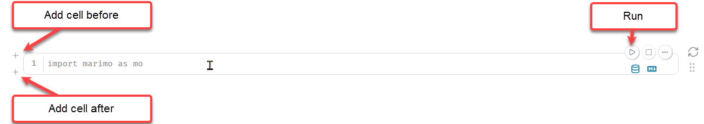
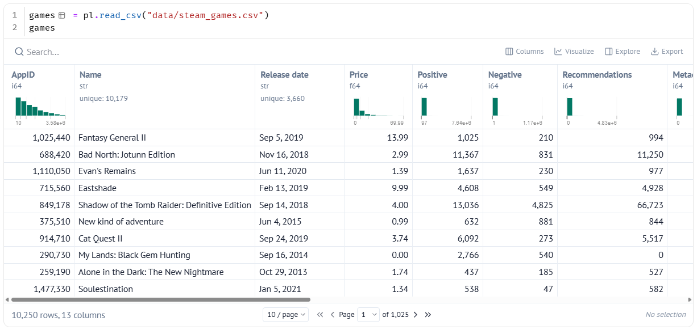
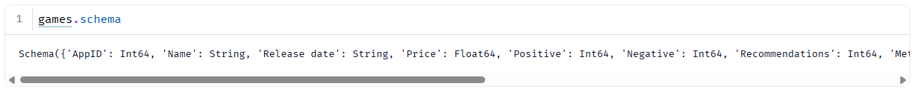
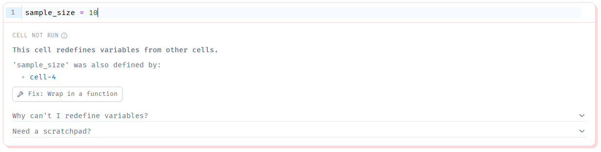

# 2. Exploring Our Data

!!! learn "In this lesson we will learn"
    - how marimo notebooks and cells work
    - how to load the Steam dataset with Polars
    - how to check the size, columns and data types of a DataFrame
    - how marimo's reactive cells update automatically
    - how to explore data with marimo's table viewer

!!! terms "Terminology"
    - **notebook** – a file where we write code in small blocks called cells and see each cell's result straight away.
    - **cell** – one block of code in a notebook, which we can run on its own.
    - **DataFrame** – a table of data with rows and columns, stored in our code.
    - **CSV** – comma-separated values: a plain text file where each line is one row and the values are separated by commas.
    - **shape** – the number of rows and the number of columns in a DataFrame.
    - **schema** – the name and data type of every column in a DataFrame.
    - **reactive** – describes a notebook where changing a cell automatically re-runs every cell that uses its variables.

## Introduction

When we met the data story arc, we also met the Steam dataset on paper. Now it's time to open it. We could open a small part of it in a spreadsheet, but code lets us check every row in seconds and repeat every step exactly. We'll use **Polars** to load the data, and **marimo** to run our code and show the results.

## Notebooks and cells

A **notebook** is a file where we write code in small blocks called **cells**. When we run a cell, its result appears straight away, right next to the code. That makes notebooks great for exploring data: we try something, look at the result, then decide what to try next.

marimo notebooks are saved as ordinary Python files. Our first notebook, ***clean_steam.py***, is the one we made in [Setting Up](../start/setup.md#open-our-first-notebook). We'll use it to explore our data and clean it, until it's ready for our story.

1. Open our ***steam_data_stories*** folder in VS Code and open a new terminal. Check the prompt starts with `(.venv)`.
2. Start marimo with:

    ```text
    marimo edit clean_steam.py
    ```

    Our notebook opens in a browser tab, with one empty cell.

Here's how we work with cells in marimo:

- **type code** in a cell just like in VS Code
- **run a cell** by clicking its run button (▶) or pressing ++ctrl+enter++ (++cmd+enter++ on a Mac)
- **run a cell and start a new one below it** by pressing ++shift+enter++
- **add a new cell** by clicking the **+** button that appears above or below a cell
- the **output** of a cell appears **above** its code
- marimo **saves** our notebook automatically



!!! tip "Reopening a notebook"
    When we reopen a notebook, marimo shows our code but doesn't run it, so none of the outputs appear. Press ++ctrl+shift+r++ (++cmd+shift+r++ on a Mac) to **run all stale cells**: every cell that hasn't been run yet.

## Import Polars

Before we can use Polars, we have to **import** it, which loads the library so our notebook can use its commands. We always put our imports in the first cell, so anyone reading our notebook can see which libraries it needs.

In the empty cell, type the code below and run it.

```python linenums="1" title="clean_steam.py — first cell"
--8<-- "examples/hook/02_exploring_data/cell01.py"
```

!!! primm "PRIMM"
    1. **Predict** what you think will happen when we run the cell. Be specific.
    2. **Run** the cell.
    3. Time to **investigate** the code. What does each line do?

??? note "Code explanation"
    - **line 1** → imports the Polars library and gives it the short name `pl`, so we can type `pl` instead of `polars` every time we use it.

Nothing appears above the cell, and that's what we want. Importing a library doesn't produce any output; it just makes the library ready to use. If the cell shows a red `ModuleNotFoundError`, Polars isn't installed in our virtual environment, so go back to [Setting Up](../start/setup.md#install-the-libraries).

## Load the data

Polars stores a table of data in a **DataFrame**: rows and columns, just like a spreadsheet, but in our code. Our data is in ***steam_games.csv***, inside our ***data*** folder, so we'll use Polars' `read_csv` to read that file into a DataFrame. We'll call the DataFrame `games`, because each row is one game.

Add a new cell, type the code below and run it.

```python linenums="1" title="clean_steam.py — new cell"
--8<-- "examples/hook/02_exploring_data/cell02.py"
```

!!! primm "PRIMM"
    1. **Predict** what you think will happen when we run the cell. Be specific.
    2. **Run** the cell.
    3. Time to **investigate** the code. What does each line do?

??? note "Code explanation"
    - **line 1** → reads every row of ***steam_games.csv*** from our ***data*** folder into a Polars DataFrame and stores it in a variable called `games`.
    - **line 2** → shows `games` as the cell's output, because marimo displays the value of the last line of a cell.

Above the cell, marimo shows the DataFrame as an interactive table.



!!! tip "CSV files"
    **CSV** stands for **comma-separated values**. A CSV file is plain text: each line is one row, and the values in a row are separated by commas. It's one of the most common ways to share data, because almost any program can read it.

## How big is our data?

Before we explore, let's find out how much data we have. The number of rows tells us how many games we can compare, and the number of columns tells us how many facts we have about each one. A DataFrame's **shape** gives us both at once.

Add a new cell, type the code below and run it.

```python linenums="1" title="clean_steam.py — new cell"
--8<-- "examples/hook/02_exploring_data/cell03.py"
```

!!! primm "PRIMM"
    1. **Predict** what you think will happen when we run the cell. Be specific.
    2. **Run** the cell.
    3. Time to **investigate** the code. What does each line do?

??? note "Code explanation"
    - **line 1** → shows the **shape** of `games`: the number of rows, then the number of columns.

The output shows two numbers: **10250** rows and **13** columns. Each row is one game, so our classroom copy holds 10,250 Steam games, with 13 facts about each one.

Notice that this cell uses `games`, which we made in a different cell. Once a cell creates a variable, every other cell in the notebook can use it.

## What kind of data is in each column?

Every column in a DataFrame has a **data type**, which tells Polars what kind of values it holds. The data type decides what we can do with a column: we can add up numbers, but not text. Before we use any column, we check its data type with the DataFrame's **schema**.

Add a new cell, type the code below and run it.

```python linenums="1" title="clean_steam.py — new cell"
--8<-- "examples/hook/02_exploring_data/cell04.py"
```

!!! primm "PRIMM"
    1. **Predict** what you think will happen when we run the cell. Be specific.
    2. **Run** the cell.
    3. Time to **investigate** the code. What does each line do?

??? note "Code explanation"
    - **line 1** → shows the **schema** of `games`: the name and data type of every column.



The schema lists all 13 columns. We'll meet three data types again and again:

| Data type | What it holds | Example column |
| :-- | :-- | :-- |
| **Int64** | whole numbers | `Positive` |
| **Float64** | numbers with a decimal point | `Price` |
| **String** | text | `Name` |

Let's think about this: `Release date` is a **String**, not a date. Polars couldn't work out that it holds dates, so it stored them as text. We can't sort text dates into the right order or work out which year a game came out, so we'll need to fix this column in Behind the Scenes.

## Reactive cells

marimo notebooks are **reactive**: when we change a cell, marimo automatically re-runs every cell that uses its variables. Let's see it in action. We'll store a number in one cell, then use that number in another cell to decide how many rows to show.

Add a new cell, type the code below and run it.

```python linenums="1" title="clean_steam.py — new cell"
--8<-- "examples/hook/02_exploring_data/cell05.py"
```

??? note "Code explanation"
    - **line 1** → creates a variable called `sample_size` that holds the number `5`.

Now we'll use `sample_size` with the `head` method, which shows the first few rows of a DataFrame. Add another new cell, type the code below and run it.

```python linenums="1" title="clean_steam.py — new cell"
--8<-- "examples/hook/02_exploring_data/cell06.py"
```

!!! primm "PRIMM"
    1. **Predict** what you think will happen when we run the cell. Be specific.
    2. **Run** the cell.
    3. Time to **investigate** the code. What does each line do?
    4. Now go back to the `sample_size` cell, change `5` to `10` and run it. **Predict** what will happen to the `head` cell before you look.

??? note "Code explanation"
    - **line 1** → shows the first `sample_size` rows of `games`, using the `head` method.

When we changed `sample_size` and ran its cell, the `head` cell re-ran by itself and showed ten rows. marimo knows that the `head` cell uses `sample_size`, so whenever `sample_size` changes, the `head` cell updates too. We never have to remember which cells to re-run.

### One variable, one cell

Reactivity only works if marimo knows exactly which cell creates each variable. So marimo has one important rule: **each variable can only be created in one cell**.

Let's see what happens if we break the rule, by creating `sample_size` again in a second cell. Add a new cell, type the code below and run it.

```python linenums="1" title="clean_steam.py — new cell"
--8<-- "examples/hook/02_exploring_data/cell05b.py"
```

??? note "Code explanation"
    - **line 1** → tries to create `sample_size` again, in a second cell.

marimo doesn't run the new cell. Instead, it shows this message:



- **CELL NOT RUN** → marimo has refused to run this cell.
- **This cell redefines variables from other cells.** → the cell creates a variable that another cell already creates.
- **'sample_size' was also defined by: cell-4** → names the variable, and the cell that created it first. Click the cell's name to jump to it.

marimo can't tell which value `sample_size` should have, so it won't run the new cell. To fix it, delete the cell we just added: hover over it and click the delete (bin) button in its toolbar. When we want a different value, we change the original cell instead.

!!! tip "Fix: Wrap in a function"
    marimo offers a **Fix: Wrap in a function** button. Don't use it for this: it hides the problem rather than fixing it. Deleting the extra cell, or giving the new variable a different name, is the right fix.

!!! warning "Changing a variable in another cell"
    In a normal Python program, we often change a variable later on, like `games = games.head()`. In marimo that would create `games` in a second cell, which breaks the rule. Instead, we give the new version a new name, such as `first_games = games.head()`. We'll use this pattern a lot when we clean our data.

## Exploring with the table viewer

The table marimo shows for `games` isn't just a picture: it's a tool for exploring. We can:

- **scroll** across to see all 13 columns, and use the page buttons at the bottom to move through the rows
- **sort** by a column, by clicking the column's heading
- **search** for a value, using the search box above the table
- **see a summary** of a column, such as its smallest and largest values, at the top of each column

<!-- SCREENSHOT: assets/l02_table_viewer.png — the table viewer with the sort, search and column summary features labelled -->

!!! primm "PRIMM"
    Time to **modify** how we look at the data, using the table viewer on the `games` cell:

    1. Sort the games by `Price` from highest to lowest. What are the most expensive games? Then sort from lowest to highest. What do the games that cost 0 have in common?
    2. Search for `Hollow Knight`. What do its `Positive` and `Negative` columns say? How would we work out what share of its reviews are positive?
    3. Sort by `Metacritic score`. Lots of games have a score of 0. Do you think those games are really that bad, or is something else going on?

## Your data story

Use the table viewer to explore the columns your three questions need. Open ***my_data_story.md***, add a new heading `## Exploring the data` and record your answers under it.

1. For each of your three questions from your story angles, write down which columns could help answer it.
2. For each of those columns, write down its data type and two or three example values.
3. Note anything that looks strange: empty values, impossible numbers, or numbers stored as text. These are clues for Behind the Scenes.
