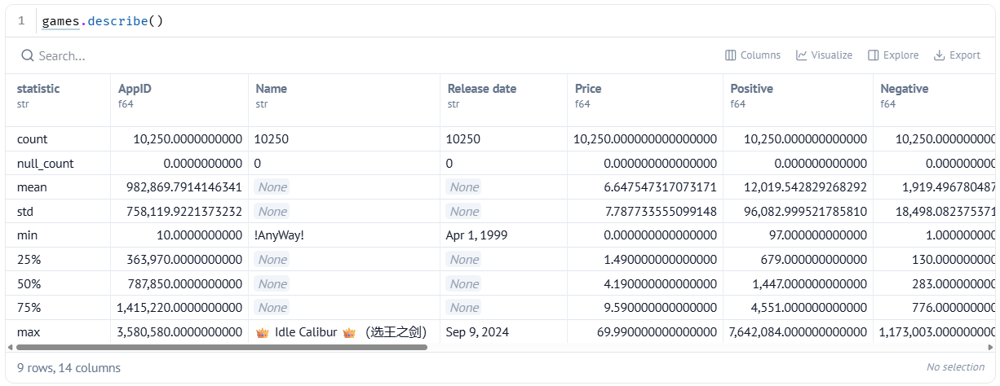
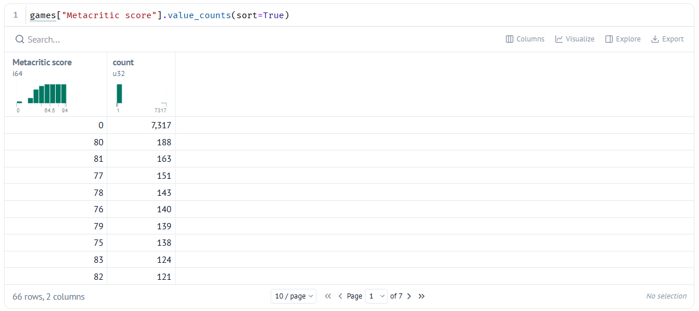

# 3. Asking a Question Data Can Answer

!!! learn "In this lesson we will learn"
    - what makes a question investigable
    - how to define the words in our question
    - how to use `describe` and `value_counts` to check a question against the data
    - how to refine a question that's too broad or can't be answered

!!! terms "Terminology"
    - **investigable question** – a question we can answer by collecting and analysing data, because it's specific, measurable and open.
    - **limitation** – something our data or our decisions can't tell us, which we should mention when we tell our story.
    - **review score** – the percentage of a game's reviews that are positive.
    - **summary statistics** – numbers that describe a whole column at once, such as its mean, median, smallest and largest values.
    - **mean** – the average: the total of all the values divided by how many values there are.
    - **median** – the middle value when all the values are sorted in order.
    - **standard deviation** – a number that shows how spread out the values are from the mean.
    - **Series** – a single column of a DataFrame.
    - **refine** – to change a question so the data can answer it, for example by narrowing it down or defining its words.

## Introduction

When we brainstormed story angles, we wrote three questions for our own data story, and when we explored our data we looked at the columns that might answer them. Now we need to check which of those questions the data can actually answer. A great question that the data can't answer leads to a story with no evidence, and a story with no evidence isn't a data story.

## Investigable questions

An **investigable question** is a question we can answer by collecting and analysing data. Good investigable questions are:

- **specific:** it's clear exactly what we're looking at
- **measurable:** the answer comes from columns we actually have
- **open:** the answer isn't obvious before we look

Let's compare some questions about Steam games:

| Question | Investigable? | Why |
| :-- | :-- | :-- |
| What's the best game on Steam? | no | "best" isn't measurable; best for who? |
| Are games getting more expensive? | almost | which games, and since when? |
| Has the median price of Steam games changed between 2015 and 2024? | yes | specific, measurable with `Price` and `Release date`, and the answer isn't obvious |
| Do people like Action games? | no | "like" isn't measurable as it stands |
| Do Action games get a higher share of positive reviews than other games? | yes | uses `Genres`, `Positive` and `Negative` |

### Example questions

Here are some investigable questions about the Steam data:

- Has the share of positive reviews changed for games released each year?
- Do free games get a higher share of positive reviews than paid games?
- Do games with more achievements get more recommendations?
- Which genre has the highest median price?
- Do games that Metacritic's critics liked also get good reviews from players?
- Do publishers that release lots of games get better reviews than publishers with only one game?

!!! primm "PRIMM"
    Time to **modify** some questions. Can you write two more investigable questions about the Steam data? For each one, write down which columns would answer it.

## Defining our terms

Even a specific question can hide a word that means different things to different people. Our example question is:

> **Do Indie games review as well as games from big studios?**

To answer it, we need to decide exactly what our words mean:

1. **"Indie games"** → games that have `Indie` in their `Genres` column. On Steam, the developers choose their game's genres, so these are games whose makers call them Indie.
2. **"games from big studios"** → our data doesn't say how big a studio is. So we'll compare Indie games with **every other game**, and call them "not Indie". That's a **limitation**: some "not Indie" games come from small studios too. We'll mention it when we tell our story.
3. **"review as well"** → the **review score**: the percentage of a game's reviews that are positive. Hollow Knight has 403,641 positive and 12,305 negative reviews, so its review score is about 97%.

Before we go any further, let's check we have enough Indie games to compare. If only a handful of games were Indie, any difference we found could just be luck. Our definition says a game is Indie if its `Genres` text contains `Indie`, so we'll check each game's `Genres` for that word and count the matches.

Start marimo with `marimo edit clean_steam.py` and press ++ctrl+shift+r++ (++cmd+shift+r++ on a Mac) to run our earlier cells. Then add a new cell, type the code below and run it.

```python linenums="1" title="clean_steam.py — new cell"
--8<-- "examples/hook/03_asking_questions/cell07.py"
```

!!! primm "PRIMM"
    1. **Predict** what you think will happen when we run the cell. Be specific.
    2. **Run** the cell.
    3. Time to **investigate** the code. What does each line do?
    4. Time to **modify** the code. Change `"Indie"` to another genre, such as `"Strategy"` or `"Simulation"`. How many games have that genre?

??? note "Code explanation"
    - **line 1** → checks each value in the `Genres` column to see whether it contains the text `Indie`, then adds up how many do.

The output is **6243**. Out of 10,250 games, 6,243 are Indie games, which leaves 4,007 that aren't. That's plenty of games in each group to compare.

!!! tip "Counting with true and false"
    `str.contains` gives `true` or `false` for each value. When we `sum` them, each `true` counts as 1 and each `false` counts as 0, so the total is the number of matches.

## Checking our question against the data

Now let's check that the columns we need hold useful values. Polars gives us two quick ways to do this.

### Summary statistics

We want a quick overview of every column at once: how many values are missing, and what the typical, smallest and largest values are. Strange numbers in this overview are often the first sign of a problem. Polars' `describe` method calculates all of these for us.

Add a new cell, type the code below and run it.

```python linenums="1" title="clean_steam.py — new cell"
--8<-- "examples/hook/03_asking_questions/cell08.py"
```

!!! primm "PRIMM"
    1. **Predict** what you think will happen when we run the cell. Be specific.
    2. **Run** the cell.
    3. Time to **investigate** the code. What does each line do?

??? note "Code explanation"
    - **line 1** → calculates **summary statistics** for every column of `games` and shows them as a table.



Each row of the output is one statistic:

| Statistic | What it tells us |
| :-- | :-- |
| **count** | how many values the column has |
| **null_count** | how many values are missing |
| **mean** | the average |
| **std** | the **standard deviation**: how spread out the values are |
| **min** and **max** | the smallest and largest values |
| **25%**, **50%**, **75%** | the values a quarter, half and three-quarters of the way through, when the values are sorted. The **50%** value is the **median**: the middle value. |

Let's think about what the numbers tell us:

1. The median `Price` is 4.19 and the mean is about 6.65. A few expensive games pull the mean up, so the median gives a fairer picture of a "typical" game.
2. The median `Metacritic score` is 0. Half of these popular games scored 0 out of 100? That's very unlikely. It's a clue that 0 really means "no score", which we'll fix when we fix our data.
3. The smallest `Release date` is `Apr 1, 1999` and the largest is `Sep 9, 2024`. That's not the oldest and newest game: it's the first and last in **alphabetical** order, because the dates are stored as text. Another job for fixing our data.

!!! tip "What is a price of 4.19?"
    `Price` has no currency symbol, so we need to check where it came from. Our data was collected from the US Steam store, so every price is in **US dollars**. A median of 4.19 means about US$4.19, which is more in Australian dollars, and Steam sets Australian prices separately anyway. The prices were also collected on one day, so a game that was on sale that day shows its sale price, and a price of 0 means the game is free to play. When we talk about prices in our story, we always say they're in US dollars.

### Counting values

The Metacritic scores looked strange, so let's look closer at that one column. Counting how often each value appears will show us whether 0 is common or rare. We'll sort the counts so the most common value comes first.

Add a new cell, type the code below and run it.

```python linenums="1" title="clean_steam.py — new cell"
--8<-- "examples/hook/03_asking_questions/cell09.py"
```

!!! primm "PRIMM"
    1. **Predict** what you think will happen when we run the cell. Be specific.
    2. **Run** the cell.
    3. Time to **investigate** the code. What does each line do?
    4. Time to **modify** the code. Change `"Metacritic score"` to `"Achievements"` and run it again. Is 0 a real value for achievements, or does it mean "missing"?

??? note "Code explanation"
    - **line 1** → picks the `Metacritic score` column from `games`, counts how many times each different value appears, and sorts the results from most common to least common.



The most common score is `0`, with **7,317** games. The next most common is `80`, with only 188. So about seven in ten of our games have no Metacritic score at all. That's fine for our example question, because we're using player reviews, not Metacritic. But if our own question uses `Metacritic score`, we'll only have about three in ten of the games to work with.

!!! tip "Square brackets pick one column"
    `games["Metacritic score"]` picks a single column from a DataFrame. A single column is called a **Series**. Many methods, like `value_counts`, work on a Series rather than a whole DataFrame.

## Refining our question

If the data can't answer our question, we don't give up on it: we **refine** it. Common fixes are:

- **narrow it down:** "Are games getting more expensive?" → "Has the median price of Steam games changed between 2015 and 2024?"
- **swap in a column that works:** if `Metacritic score` is missing for the games we care about, use `Positive` and `Negative` instead
- **define the fuzzy words:** "popular" → "has more than 10,000 recommendations"

Our refined example question is:

> **Do Indie games get a higher review score than games that aren't Indie, and do they cost less?**

It's more precise, and every part of it can be measured.

## Your data story

Open ***my_data_story.md***, add a new heading `## Choosing a question` and record your answers under it. Work through all three of your questions from your story angles.

1. Check each question against the three features of an investigable question: specific, measurable and open. Rewrite any that aren't.
2. For each question, write down what each fuzzy word means, like we did for "Indie" and "review as well".
3. Use `describe`, `value_counts` or `str.contains` on the columns each question needs. Do they have enough real values to answer it?
4. Refine any question the data can't answer, using one of the fixes above.
5. Choose the **one** question you'll use for the rest of your data story, and write down why you chose it over the other two. Put your final question on its own line, so it's easy to find later.
