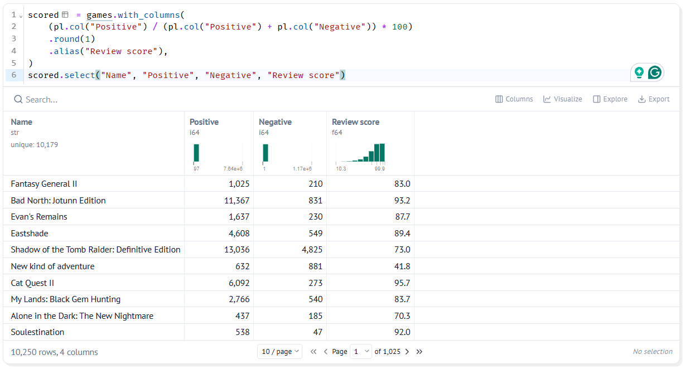
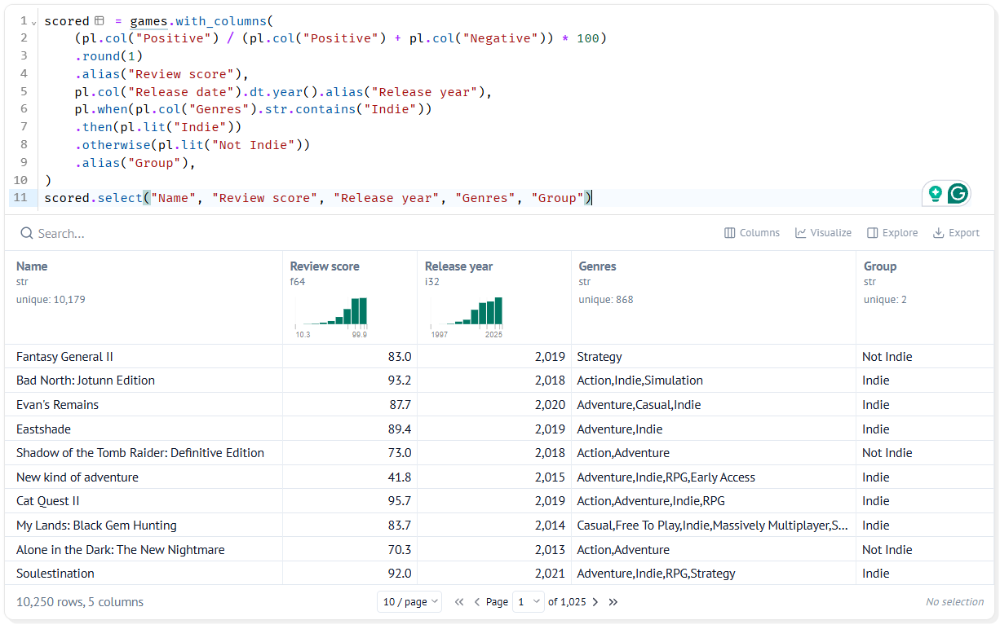

# 7. Making New Columns

!!! learn "In this lesson we will learn"
    - what the Rising Insights stage of our story does
    - how to start a second notebook and load our clean data
    - how to calculate a new column from other columns
    - how to sort games into groups with `pl.when`

!!! terms "Terminology"
    - **literal** – a value written straight into our code, such as `pl.lit("Indie")`, that is the same for every row.

## Introduction

Welcome to **Rising Insights**. Our data is clean, so now we can start finding things out. Each Rising Insights lesson adds one more piece of evidence to our story, building up to the Aha Moment.

Often the column we need isn't in the data yet. Steam gives us the number of positive and negative reviews, but our question is about the **review score**. It gives us a full release date, but we'll want to compare years. And it lists each game's genres, but we want a simple label: Indie or not. In this lesson we'll make all three columns from the ones we have.

## A new notebook

From now on we'll work in a second notebook, ***steam_story.py***, that starts from the clean data we saved when we fixed our data. Keeping cleaning and storytelling in separate notebooks means each one stays short enough to follow.

!!! tip "Why two notebooks?"
    Data scientists usually keep cleaning separate from analysis. Splitting our work this way helps us in four ways:

    - **each notebook has one job:** ***clean_steam.py*** turns raw data into clean data, and ***steam_story.py*** turns clean data into a story. When something looks wrong, we know which notebook to check.
    - **our story starts from trusted data:** every chart in ***steam_story.py*** uses the same clean file, so we can't accidentally build a chart from a messy version of the data.
    - **our audience sees only the story:** when we publish our story, we'll publish ***steam_story.py***. The cleaning steps stay behind the scenes, just like the Behind the Scenes stage of our story arc.
    - **it's faster:** loading ***clean_games.parquet*** is quicker than reading the CSV and repeating every cleaning step each time we open our story.

    If we find another problem in the data later, we fix it in ***clean_steam.py***, run its saving cell again, then re-run ***steam_story.py***.

1. If marimo is still running, click in the VS Code terminal, press ++ctrl+c++, type `y` and press ++enter++ to stop it. The terminal shows the `(.venv)` prompt again.
2. In the terminal, type the command below and press ++enter++ to create and open our second notebook.

    ```text
    marimo edit steam_story.py
    ```

    A new browser tab opens with an empty notebook, and ***steam_story.py*** appears in VS Code's Explorer panel.

A new notebook knows nothing about the last one, so the first thing it needs is Polars. In the empty cell, type the code below and run it.

```python linenums="1" title="steam_story.py — first cell"
--8<-- "examples/insights/07_new_columns/story01.py"
```

??? note "Code explanation"
    - **line 1** → imports Polars with the short name `pl`.

Next we load the clean data we saved. We use `pl.read_parquet` instead of `pl.read_csv` because our file is a Parquet file, and we call the result `games` because it's the table every later cell starts from. Add a new cell, type the code below and run it.

```python linenums="1" title="steam_story.py — new cell"
--8<-- "examples/insights/07_new_columns/story02.py"
```

!!! primm "PRIMM"
    1. **Predict** what you think will happen when we run the cell. Be specific.
    2. **Run** the cell.
    3. Time to **investigate** the code. What does each line do?

??? note "Code explanation"
    - **line 1** → loads ***clean_games.parquet*** into a DataFrame called `games`.
    - **line 2** → shows `games` as the cell's output.

`games` has **10250** rows and **10** columns, just like `clean_games` when we saved it. Check the column types: `Release date` is still a date, and the missing Metacritic scores are still nulls. Parquet kept all our cleaning work.

!!! tip "games in two notebooks"
    `games` in this notebook is our clean data, but `games` in ***clean_steam.py*** is the raw data. That's fine: each notebook has its own variables, so the two can't clash.

## Calculating a review score

A game with 900 positive and 100 negative reviews, and a game with 9,000 positive and 1,000 negative, are both liked by 90% of reviewers. The review score lets us compare games of any size.

So instead of comparing raw review counts, which would just tell us which games are most played, we'll work out the percentage of reviews that are positive: `Positive` divided by the total number of reviews, times 100. We round it to 1 decimal place because more digits wouldn't change any comparison and would make the table harder to read. We use `with_columns` because we want to keep every column and add a new one, and we only show four columns at the end so we can check the calculation by eye. Add a new cell, type the code below and run it.

```python linenums="1" title="steam_story.py — new cell"
--8<-- "examples/insights/07_new_columns/story03a.py"
```

!!! primm "PRIMM"
    1. **Predict** what you think will happen when we run the cell. Be specific.
    2. **Run** the cell.
    3. Time to **investigate** the code. What does each line do?

??? note "Code explanation"
    - **line 1** → starts making a new version of `games` with an extra column, and will store it in `scored`.
    - **line 2** → divides `Positive` by the total number of reviews, `Positive` plus `Negative`, and multiplies by 100 to make a percentage.
    - **line 3** → rounds the result to 1 decimal place.
    - **line 4** → names the new column `Review score`, using `alias`.
    - **line 5** → closes the `with_columns` brackets.
    - **line 6** → shows only the `Name`, `Positive`, `Negative` and `Review score` columns of `scored`.



The first game, Fantasy General II, has 1,025 positive and 210 negative reviews, so its review score is **83.0**. Every game has a score, because every game in our data has at least 500 reviews.

!!! tip "alias names a new column"
    Without `alias`, the new column would take the name of the first column in the calculation, `Positive`, and replace it. `alias` gives it its own name.

## Years and groups

Two more columns will help us compare games: the release **year**, and a **group** that labels every game as `Indie` or `Not Indie`.

- **Release year:** our question asks whether Indie games have done better over time. Comparing every single date would give us thousands of tiny groups, so we'll group games by year instead. `dt.year` pulls the year out of a date.
- **Group:** our question compares Indie games with all the others. `Genres` holds text like `Action,Adventure,Indie`, so a game is Indie if that text contains `Indie`. `pl.when` lets us give each row one label if a test is true and another label if it isn't.

We add these to the same `with_columns` as the review score, because they all describe the same games and belong in the same table. Change the cell to match the code below and run it.

```python linenums="1" title="steam_story.py — change existing cell" hl_lines="5-9 11"
--8<-- "examples/insights/07_new_columns/story03.py"
```

!!! primm "PRIMM"
    1. **Predict** what you think will happen when we run the cell. Be specific.
    2. **Run** the cell.
    3. Time to **investigate** the code. What does each line do?
    4. Time to **modify** the code. Add a column called `Free` that is `True` when `Price` is 0. Hint: we don't need `pl.when`, because a comparison already gives `True` or `False`.

??? note "Code explanation"
    - **line 5** → gets the year from each `Release date`, using `dt.year`, and names the new column `Release year`.
    - **line 6** → starts a `pl.when`, which works like `if` in Python, and tests whether the `Genres` text contains `Indie`.
    - **line 7** → if it does, the value is the text `Indie`. `pl.lit` means a **literal** value: the same text for every matching row, rather than a column name.
    - **line 8** → otherwise, the value is `Not Indie`, like `else` in Python.
    - **line 9** → names the new column `Group`.
    - **line 11** → shows the `Name`, `Review score`, `Release year`, `Genres` and `Group` columns of `scored`.



Every game now has a `Release year` and a `Group`. Look down the `Genres` and `Group` columns together: every game with `Indie` in its genres is in the `Indie` group, and every other game is `Not Indie`.

!!! tip "Why a text label?"
    We could have made a `True`/`False` column instead. A text label like `Indie` or `Not Indie` is easier to read in tables, and it will appear in our chart legends without any extra work when we make bar charts and histograms.

## Your data story

Open ***my_data_story.md***, add a new heading `## New columns` and record your answers under it.

1. Write down one new column your question needs that isn't in the data, and how you could calculate it from the columns you have.
2. Add it to the `scored` cell, run it, and check a few rows by hand to make sure the values are right.
3. If your question compares groups, write a `pl.when` that labels each game with its group.
