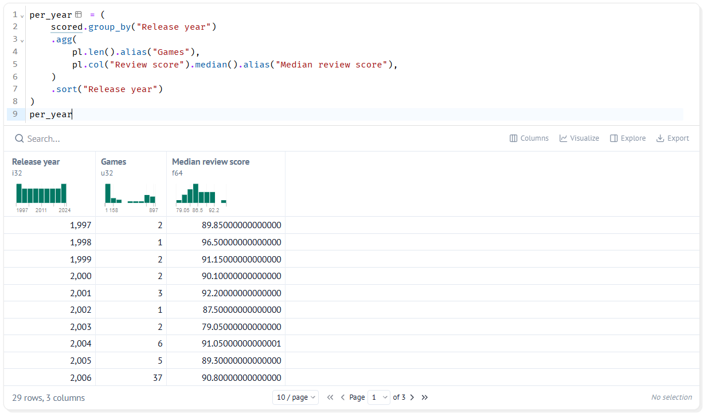

# 8. Summarising Groups

!!! learn "In this lesson we will learn"
    - how to split data into groups with `group_by`
    - how to summarise each group with `agg`
    - how to count rows with `pl.len`
    - when to use the mean and when to use the median

!!! terms "Terminology"
    - **aggregate** – to combine the values in a group into one number, such as a count, mean or median.
    - **skewed** – describes data where a few values are much bigger or smaller than the rest, which pulls the mean away from the median.

## Introduction

A table of 10,250 games can't tell a story by itself. Our audience needs a few clear numbers: how the Indie games compare with the others, or how many games came out each year. To get those numbers, we **summarise** groups of rows.

Every summary in this lesson follows the same three steps, often called **split, apply, combine**:

1. **split** the rows into groups, such as one group for `Indie` and one for `Not Indie`
2. **apply** a calculation to each group, such as finding its median review score
3. **combine** the answers into a new, much smaller table, with one row per group

## Comparing our two groups

Our question compares Indie games with all the others, so we'll split the games by our `Group` column. For each group we want two numbers: how many games are in it, so we know whether the group is big enough to trust, and its median review score, which tells us how well a typical game in that group is reviewed. We use the median rather than the mean for now, and we'll see why further down this page.

Start marimo with `marimo edit steam_story.py` and press ++ctrl+shift+r++ (++cmd+shift+r++ on a Mac) to run our earlier cells. Add a new cell at the bottom, type the code below and run it.

```python linenums="1" title="steam_story.py — new cell"
--8<-- "examples/insights/08_summarising_groups/story04.py"
```

!!! primm "PRIMM"
    1. **Predict** what you think will happen when we run the cell. Be specific.
    2. **Run** the cell.
    3. Time to **investigate** the code. What does each line do?
    4. Time to **modify** the code. Add a line inside `agg` that works out the median `Recommendations` of each group. Which group gets more recommendations?

??? note "Code explanation"
    - **line 1** → opens a bracket so our code can go over several lines, and will store the result in `per_group`.
    - **line 2** → **splits** the rows of `scored` into groups, one for each different value in `Group`, using `group_by`.
    - **line 3** → starts `agg`, short for **aggregate**, which **applies** calculations to each group.
    - **line 4** → counts the rows in each group with `pl.len`, and names the answer `Games`.
    - **line 5** → finds the median `Review score` of each group, and names it `Median review score`.
    - **line 6** → closes the `agg` brackets, which **combines** the answers into one table.
    - **line 7** → sorts the table by `Group`, because `group_by` doesn't keep the groups in any order.
    - **line 8** → closes the bracket we opened on line 1.
    - **line 9** → shows `per_group` as the cell's output.

| Group | Games | Median review score |
| :-- | --: | --: |
| Indie | 6243 | 86.5 |
| Not Indie | 4007 | 83.2 |

That's our first piece of evidence. The typical Indie game gets **86.5%** positive reviews, compared with **83.2%** for other games.

## Mean or median?

Our question also asks whether Indie games cost less. There are two common kinds of average, the mean and the median, and they don't always agree. To see whether that matters for prices, we'll work out both for each group, side by side in the same table. We round the mean to 2 decimal places because prices are in dollars and cents. Add a new cell, type the code below and run it.

```python linenums="1" title="steam_story.py — new cell"
--8<-- "examples/insights/08_summarising_groups/story05.py"
```

!!! primm "PRIMM"
    1. **Predict** what you think will happen when we run the cell. Be specific.
    2. **Run** the cell.
    3. Time to **investigate** the code. What does each line do?

??? note "Code explanation"
    - **line 1** → opens a bracket for our code, and will store the result in `prices`.
    - **line 2** → splits the rows of `scored` into one group for each value in `Group`.
    - **line 3** → starts `agg`.
    - **line 4** → finds the median `Price` of each group.
    - **line 5** → finds the mean `Price` of each group, rounded to 2 decimal places.
    - **line 6** → closes the `agg` brackets.
    - **line 7** → sorts the table by `Group`.
    - **line 8** → closes the bracket we opened on line 1.
    - **line 9** → shows `prices` as the cell's output.

| Group | Median price | Mean price |
| :-- | --: | --: |
| Indie | 3.84 | 5.57 |
| Not Indie | 4.99 | 8.32 |

!!! tip "What currency are these prices in?"
    These prices are in **US dollars**, because the data was collected from the US Steam store. They're also the prices on the one day the data was collected, so a game on sale that day shows its sale price. When we write about prices in our story, say they're in US dollars, so our audience doesn't read them as Australian dollars.

Indie games cost less by either measure, but look at the gap. The median prices are only $1.15 apart, while the mean prices are $2.75 apart. Why?

Most games are cheap, but a few cost $60 or $70. Those few expensive games pull the mean up, and most of them aren't Indie games. When the data is **skewed** like this, with a few values much bigger than the rest, the mean and the median tell different stories:

- the **median** describes a **typical** game
- the **mean** is pulled towards the few **very large** values

Neither is wrong, but we need to choose the one that matches what we want to say, and tell our audience which one we used. For prices, the median gives the fairer picture of what a typical game costs.

!!! tip "Other ways to summarise"
    Inside `agg` we can use `mean`, `median`, `min`, `max` and `sum` on any column, and `pl.len()` to count rows. We can use as many as we like, each with its own `alias`.

## Games per year

We can group by any column, not just `Group`. Our story is about how Indie games have done over time, so before we compare years, we need to know how many games each year has. A year with only a few games can't tell us much. We'll group by `Release year`, count the games and find the median review score for each year, then sort by year so the table reads in time order. Add a new cell, type the code below and run it.

```python linenums="1" title="steam_story.py — new cell"
--8<-- "examples/insights/08_summarising_groups/story06.py"
```

!!! primm "PRIMM"
    1. **Predict** what you think will happen when we run the cell. Be specific.
    2. **Run** the cell.
    3. Time to **investigate** the code. What does each line do?
    4. Time to **modify** the code. Change `"Release year"` on line 2 to `"Metacritic score"`. What does the new table tell us?

??? note "Code explanation"
    - **line 1** → opens a bracket for our code, and will store the result in `per_year`.
    - **line 2** → splits the rows of `scored` into one group for each `Release year`.
    - **line 3** → starts `agg`.
    - **line 4** → counts the games in each year.
    - **line 5** → finds the median review score of each year.
    - **line 6** → closes the `agg` brackets.
    - **line 7** → sorts the table by `Release year`.
    - **line 8** → closes the bracket we opened on line 1.
    - **line 9** → shows `per_year` as the cell's output.



There's one row per year: 29 rows, from 1997 to 2025. Scroll down to the end:

- the busiest year is **2024**, with 929 games
- 2025 has only **424** games, less than half of 2024
- the years before 2006 have only a handful of games each

!!! warning "Watch out for small groups"
    1998 has a median review score of 96.5, but that's from just **1** game. A summary of one or two games isn't evidence of anything. When we compare groups, we check the `Games` column first, and leave out groups that are too small.

## Your data story

Open ***my_data_story.md***, add a new heading `## Summaries` and record your answers under it.

1. Write a `group_by` that summarises the groups your question is about. Record the table it makes.
2. Decide whether the mean or the median suits your question better, and write down why.
3. Write one sentence that states a finding, using a number from your summary. For example: "The typical Indie game gets 86.5% positive reviews, compared with 83.2% for other games."
