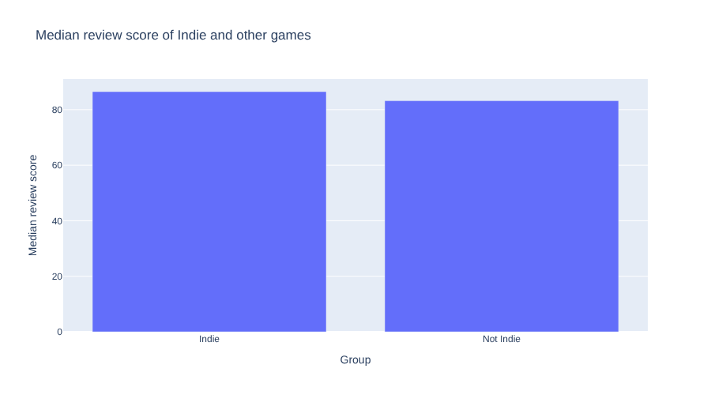
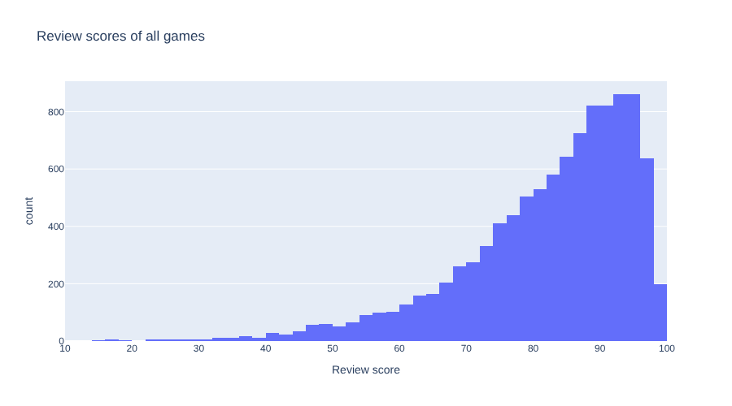
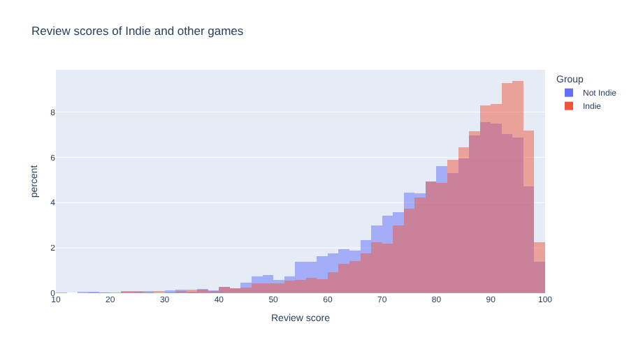

# 9. Bar Charts and Histograms

!!! learn "In this lesson we will learn"
    - how to draw a bar chart with Plotly Express
    - how to draw a histogram to see how values are spread out
    - how to compare groups of different sizes with percentages

!!! terms "Terminology"
    - **histogram** – a chart that splits values into equal ranges and draws a bar for how many values land in each one.
    - **bin** – one of the equal ranges of values that a histogram counts.

## Introduction

A table of numbers makes our audience do the work. A good chart does the work for them: one look, and the finding is obvious. In this lesson we'll turn our summaries from Lesson 8 into charts.

We'll use **Plotly Express**, which draws a whole chart from a DataFrame in one function call. Its charts are interactive: we can hover over them to see exact values, and drag to zoom in.

## Importing Plotly Express

Start marimo with `marimo edit steam_story.py` and press ++ctrl+shift+r++ (++cmd+shift+r++ on a Mac) to run our earlier cells. Go to the **first** cell, the one that imports Polars, and change it to match the code below. Then run it.

```python linenums="1" title="steam_story.py" hl_lines="1"
--8<-- "examples/insights/09_bar_histogram/story01.py"
```

??? note "Code explanation"
    - **line 1** → imports Plotly Express with the short name `px`, which is what everyone who uses Plotly calls it.

!!! tip "Keep imports together"
    We could import Plotly in a new cell, but keeping all our imports in the first cell means anyone reading our notebook can see every library it needs in one place. We sort them in alphabetical order, so they're easy to scan.

## Bar charts

A **bar chart** compares one number across groups, using the height of each bar. Let's chart the median review score of our two groups. Add a new cell at the bottom, type the code below and run it.

```python linenums="1" title="steam_story.py"
--8<-- "examples/insights/09_bar_histogram/story07.py"
```

!!! primm "PRIMM"
    1. **Predict** what you think will happen when we run the cell. Be specific.
    2. **Run** the cell.
    3. Time to **investigate** the code. What does each line do?
    4. Time to **modify** the code. Change `per_group` to `prices` and `"Median review score"` to `"Median price"`. Change the title to match.

??? note "Code explanation"
    - **line 1** → starts a bar chart, using `px.bar`.
    - **line 2** → uses the `per_group` DataFrame from Lesson 8 as the data.
    - **line 3** → puts each group along the bottom, the **x-axis**.
    - **line 4** → sets the height of each bar to the median review score, on the **y-axis**.
    - **line 5** → sets the chart's title.
    - **line 6** → closes the brackets. The chart is the last value in the cell, so marimo shows it.



Hover over a bar to see its exact value, and drag across part of the chart to zoom in. Double-click to zoom back out.

Look closely: the two bars are almost the same height. The gap between 86.5 and 83.2 is real, but this chart makes it hard to see, because both bars start from 0. A bar chart is good for showing that two groups are **similar**. To show how they **differ**, we need a chart that shows more of the data.

## Histograms

A median is one number for a whole group. A **histogram** shows how all the values are spread out. It splits the values into equal ranges called **bins**, and draws a bar for how many values land in each bin. Add a new cell, type the code below and run it.

```python linenums="1" title="steam_story.py"
--8<-- "examples/insights/09_bar_histogram/story08.py"
```

!!! primm "PRIMM"
    1. **Predict** what you think will happen when we run the cell. Be specific.
    2. **Run** the cell.
    3. Time to **investigate** the code. What does each line do?
    4. Time to **modify** the code. Change `nbins=45` to `nbins=10`, then to `nbins=200`. Which shows the shape best?

??? note "Code explanation"
    - **line 1** → starts a histogram, using `px.histogram`.
    - **line 2** → uses every game in `scored` as the data.
    - **line 3** → spreads the review scores along the x-axis. A histogram counts the rows for us, so there's no `y`.
    - **line 4** → splits the scores into about 45 bins.
    - **line 5** → sets the chart's title.
    - **line 6** → closes the brackets.



Most games score between 75 and 95, and very few score below 50. The bars climb slowly from the left, then drop sharply just before 100. That shape is another example of **skewed** data, like the prices in Lesson 8, but this time the long tail is on the low side.

## Comparing two groups

Now let's split the histogram by group. There's a catch: we have 6,243 Indie games but only 4,007 other games, so the Indie bars would be taller just because there are more Indie games. To compare fairly, we'll show each bar as a **percentage** of its own group. Add a new cell, type the code below and run it.

```python linenums="1" title="steam_story.py"
--8<-- "examples/insights/09_bar_histogram/story09.py"
```

!!! primm "PRIMM"
    1. **Predict** what you think will happen when we run the cell. Be specific.
    2. **Run** the cell.
    3. Time to **investigate** the code. What does each line do?
    4. Time to **modify** the code. Remove the `histnorm="percent"` line. What changes, and why is that less fair?

??? note "Code explanation"
    - **line 1** → starts a histogram.
    - **line 2** → uses every game in `scored` as the data.
    - **line 3** → spreads the review scores along the x-axis.
    - **line 4** → draws a separate set of bars, in a different colour, for each group, using `color`.
    - **line 5** → draws the two sets of bars over the top of each other, using `barmode="overlay"`, so we can see where they differ.
    - **line 6** → shows each bar as a percentage of its own group, using `histnorm="percent"`, so groups of different sizes can be compared.
    - **line 7** → splits the scores into about 45 bins.
    - **line 8** → sets the chart's title.
    - **line 9** → closes the brackets.



Now the difference is clear. The Indie bars are taller from about 85 up, so a bigger share of Indie games get very high scores. The other games have more of their bars between 45 and 80. That's much more convincing than two bars that look the same height.

!!! tip "Click the legend"
    Click `Indie` or `Not Indie` in the legend to hide that group, and click again to bring it back. It's a quick way to look at one group at a time.

## Our data story

Open ***my_data_story.md***, add a new heading `## Lesson 9: First charts` and record our answers under it.

1. Draw a bar chart that compares the groups in our question. Does it show the difference clearly, or do the bars look the same?
2. Draw a histogram of the most important number column in our question. Describe its shape in one sentence.
3. If our question compares groups of different sizes, split the histogram by group using percentages. Record what it shows.
