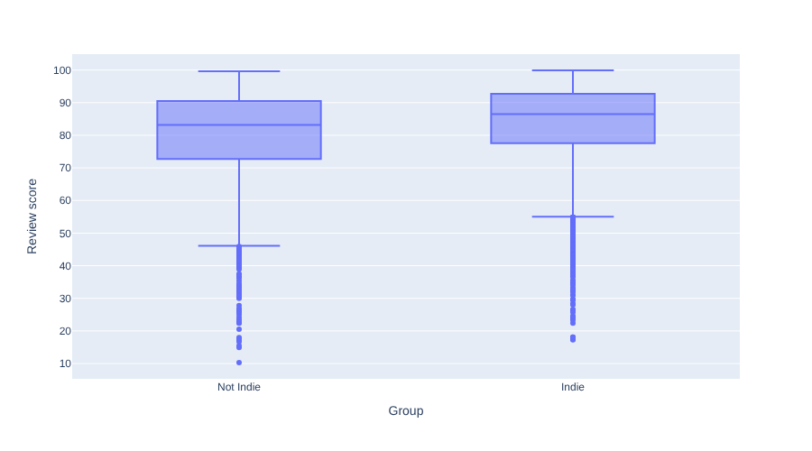
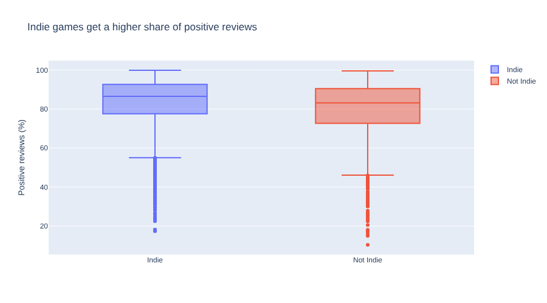

# 10. Box Plots and Better Charts

!!! learn "In this lesson we will learn"
    - how to draw and read a box plot
    - how to choose the right chart for our question
    - how to write a headline title that tells the finding
    - how to make charts clearer with labels, colours and order

!!! terms "Terminology"
    - **box plot** – a chart that shows the median, the middle half and the spread of a group's values as a box with whiskers.
    - **outlier** – a value much further away from the rest of the values than most.
    - **headline title** – a chart title that states what the chart shows, rather than what it is.

## Introduction

When we drew our first charts, we saw that the right chart can make a difference obvious, and the wrong one can hide it. In this lesson we'll meet one more kind of chart, the box plot, then learn the small changes that turn a first-draft chart into one we can put in front of an audience.

## Box plots

A **box plot** squeezes a whole histogram into one box, so we can compare the spread of several groups side by side.

!!! tip "When to use a box plot"
    Use a box plot when we want to **compare the spread of a number across groups**: not just which group has the higher median, but whether the middle half of one group sits higher than the other, and which group has more unusual values. It's tidier than overlapping histograms, especially with three or more groups. Don't use one for an audience that has never seen a box plot without explaining how to read it first.

Our split histogram was a bit crowded, with two sets of bars on top of each other. A box plot shows the same comparison more simply, with one box per group. So we'll put `Group` on the x-axis and `Review score` on the y-axis. Start marimo with `marimo edit steam_story.py` and press ++ctrl+shift+r++ (++cmd+shift+r++ on a Mac) to run our earlier cells. Add a new cell at the bottom, type the code below and run it.

```python linenums="1" title="steam_story.py — new cell"
--8<-- "examples/insights/10_better_charts/story10.py"
```

!!! primm "PRIMM"
    1. **Predict** what you think will happen when we run the cell. Be specific.
    2. **Run** the cell.
    3. Time to **investigate** the code. What does each line do?
    4. Time to **modify** the code. Change `"Review score"` to `"Price"`. What do the boxes tell us about prices?

??? note "Code explanation"
    - **line 1** → starts a box plot, using `px.box`.
    - **line 2** → uses every game in `scored` as the data.
    - **line 3** → puts one box for each group along the x-axis.
    - **line 4** → uses `Review score` for the y-axis.
    - **line 5** → closes the brackets.



Here's how to read each box:

- the **line inside the box** is the median
- the **box** holds the middle half of the games, from the 25% value to the 75% value
- the **whiskers** reach out to the most extreme values that aren't outliers
- the **dots** are **outliers**: values much further away than the rest. We'll work out how Plotly decides this when we look for outliers

Hover over a box to see its numbers. The Indie box runs from **77.6** to **92.7**, and the other box runs from **72.7** to **90.5**. The whole Indie box sits higher, not just its median.

## Choosing a chart

Different charts answer different kinds of questions:

| Our question | Chart | Plotly Express function |
| :-- | :-- | :-- |
| how does one number compare across groups? | bar chart | `px.bar` |
| how are values spread out? | histogram | `px.histogram` |
| how does the spread compare between groups? | box plot | `px.box` |
| how does something change over time? | line chart | `px.line`, see [Trends and Relationships](11_trends_relationships.md) |
| are two number columns related? | scatter plot | `px.scatter`, see [Trends and Relationships](11_trends_relationships.md) |

## Making a chart better

Our box plot works, but it's not ready for an audience yet:

1. it has no title, so the audience doesn't know what it's about
2. the y-axis says `Review score`, which our audience hasn't heard of
3. the x-axis label `Group` doesn't add anything
4. both boxes are the same colour, and `Not Indie` comes first, even though Indie games are the focus of our story

We'll fix each problem in turn: `color` gives each group its own colour, `category_orders` puts Indie first because it's the focus of our story, `labels` swaps column names for words our audience understands, and `title` states the finding. Change the cell to match the code below and run it.

```python linenums="1" title="steam_story.py — change existing cell" hl_lines="5-8"
--8<-- "examples/insights/10_better_charts/story11.py"
```

!!! primm "PRIMM"
    1. **Predict** what you think will happen when we run the cell. Be specific.
    2. **Run** the cell.
    3. Time to **investigate** the code. What does each line do?
    4. Time to **modify** the code. Write a different headline title that still states the finding.

??? note "Code explanation"
    - **line 5** → gives each group its own colour, using `color`.
    - **line 6** → puts `Indie` first and `Not Indie` second, using `category_orders`.
    - **line 7** → replaces column names on the chart with clearer labels, using `labels`. The empty text for `Group` removes the x-axis label.
    - **line 8** → sets a title that states the finding.



### Titles that tell

Look at the new title: **Indie games get a higher share of positive reviews**. It doesn't say what the chart **is** ("Review scores by group"); it says what the chart **shows**. A title like this is called a **headline title**. It tells our audience the finding before they even read the axes, which is exactly what a data story needs.

!!! tip "Keep colours the same"
    With `category_orders`, Indie is always first, so Plotly always gives it the first colour: blue. If we use the same order on every chart, Indie stays blue throughout our story, and our audience doesn't have to read the legend each time.

!!! warning "A headline must be true"
    A headline title is a claim, so it has to match the data. Before we write one, we check the numbers behind it. "Indie games get a higher share of positive reviews" is true for the medians and for the middle half of each group, but there are still plenty of Indie games with low scores.

## Your data story

Open ***my_data_story.md***, add a new heading `## Better charts` and record your answers under it.

1. Choose the best chart for your question, using the table above. Write down why it suits your question.
2. Draw it, then improve it with a headline title, clear labels and colours. Record the title.
3. Show your chart to someone else for ten seconds, then ask them what it shows. Did they get your finding? Write down what they said.
