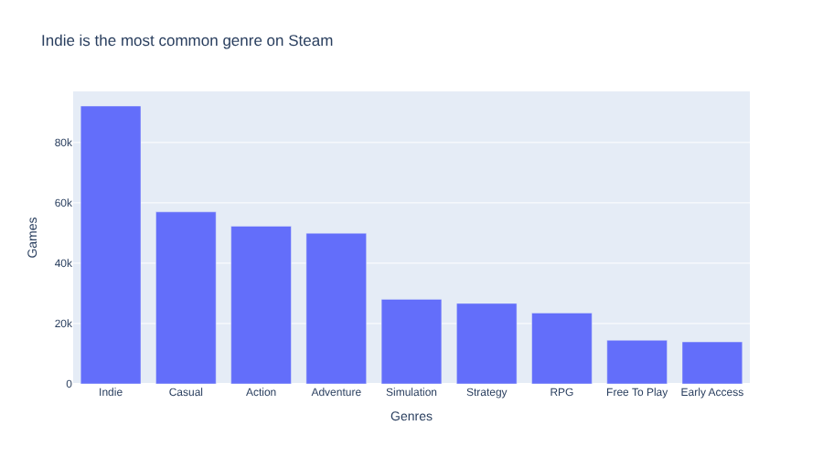
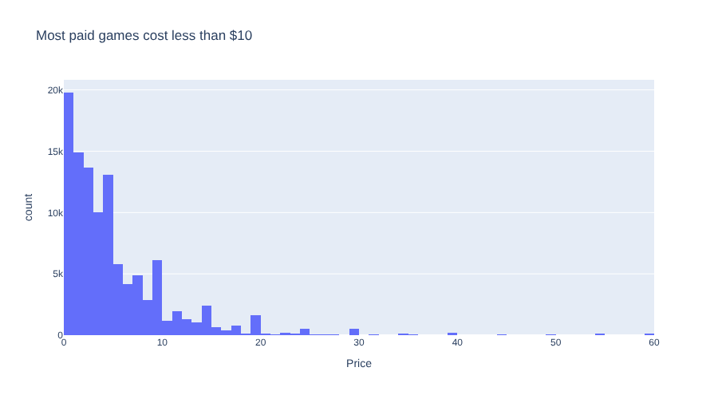
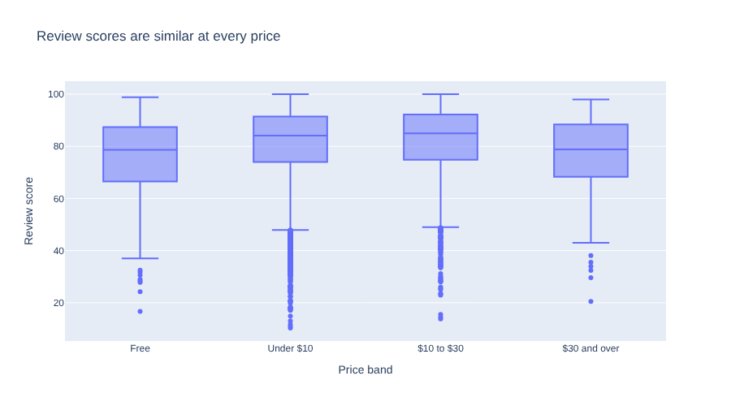

# 11. Charts that Compare

!!! learn "In this lesson we will learn"
    - how to choose a chart that suits our message
    - how to draw bar charts, histograms and box plots with Plotly Express
    - how to read a box plot
    - how to write a chart title that tells the finding

## Introduction

A table of numbers makes our audience do the work. A good chart does the work for them: one look, and the finding is obvious. In this lesson we'll turn our summaries from Lesson 10 into charts that **compare** groups.

We'll use **Plotly Express**, a library that draws a whole chart from a DataFrame in one function call. Its charts are interactive: we can hover over them to see exact values, and drag to zoom in.

## Choosing a chart

Different charts answer different kinds of questions:

| Our question | Chart | Plotly Express function |
| :-- | :-- | :-- |
| how do groups compare? | bar chart | `px.bar` |
| how are values spread out? | histogram | `px.histogram` |
| how does the spread compare between groups? | box plot | `px.box` |
| how does something change over time? | line chart | `px.line` (Lesson 12) |
| are two number columns related? | scatter plot | `px.scatter` (Lesson 12) |

## Importing Plotly Express

Start marimo with `marimo edit steam_story.py` and press ++ctrl+shift+r++ (++cmd+shift+r++ on a Mac) to run our earlier cells. Go to the **first** cell, the one that imports Polars, and change it to match the code below. Then run it.

```python linenums="1" title="steam_story.py" hl_lines="1"
--8<-- "examples/insights/11_charts_compare/story01.py"
```

??? note "Code explanation"
    - **line 1** → imports Plotly Express with the short name `px`, which is what everyone who uses Plotly calls it.

!!! tip "Keep imports together"
    We could import Plotly in a new cell, but keeping all our imports in the first cell means anyone reading our notebook can see every library it needs in one place. We sort them in alphabetical order, so they're easy to scan.

## Bar charts

A **bar chart** compares one number across groups. Let's chart the number of games in each of the top 10 genres. Add a new cell at the bottom, type the code below and run it.

```python linenums="1" title="steam_story.py"
--8<-- "examples/insights/11_charts_compare/story07.py"
```

!!! primm "PRIMM"
    1. **Predict** what you think will happen when we run the cell. Be specific.
    2. **Run** the cell.
    3. Time to **investigate** the code. What does each line do?
    4. Time to **modify** the code. Change `y="Games"` to `y="Median review score"` and change the title to match what the new chart shows.

??? note "Code explanation"
    - **line 1** → starts a bar chart, using `px.bar`.
    - **line 2** → uses the `per_genre` DataFrame from Lesson 10 as the data.
    - **line 3** → puts each genre along the bottom, the **x-axis**.
    - **line 4** → sets the height of each bar to the number of games, on the **y-axis**.
    - **line 5** → sets the chart's title.
    - **line 6** → closes the brackets. The chart is the last value in the cell, so marimo shows it.



Hover over a bar to see its exact value, and drag across part of the chart to zoom in. Double-click to zoom back out.

### Titles that tell

Look at the title: **Indie is the most common genre on Steam**. It doesn't say what the chart **is** ("Games per genre"); it says what the chart **shows**. A title like this is called a **headline title**. It tells our audience the finding before they even read the axes, which is exactly what a data story needs.

## Histograms

A **histogram** shows how values are spread out. It splits the values into equal ranges called **bins**, and draws a bar for how many values land in each bin. Add a new cell, type the code below and run it.

```python linenums="1" title="steam_story.py"
--8<-- "examples/insights/11_charts_compare/story08.py"
```

!!! primm "PRIMM"
    1. **Predict** what you think will happen when we run the cell. Be specific.
    2. **Run** the cell.
    3. Time to **investigate** the code. What does each line do?
    4. Time to **modify** the code. Change `nbins=60` to `nbins=12`, then to `nbins=200`. Which shows the shape best?

??? note "Code explanation"
    - **line 1** → starts a histogram, using `px.histogram`.
    - **line 2** → uses only the games in `scored` that cost between $0.01 and $60, using `is_between`.
    - **line 3** → spreads the prices along the x-axis. A histogram counts the rows for us, so there's no `y`.
    - **line 4** → splits the prices into about 60 bins, which makes each bin about $1 wide.
    - **line 5** → sets the chart's title.
    - **line 6** → closes the brackets.



Most bars are on the left: **87%** of paid games cost less than $10. Notice the spikes at $10, $15, $20 and $30. Developers like round prices.

!!! tip "Why leave out free and very expensive games?"
    28,504 free games would make one giant bar at $0 and squash the rest. A few items cost up to $999.99, which would stretch the x-axis so far that every other bar would be squeezed into a thin line. Leaving them out lets us see the shape of the prices most people pay. When we do this, we tell our audience which games we left out and why.

## Box plots

A **box plot** compares the spread of values between groups. Let's compare review scores across our four price bands. Add a new cell, type the code below and run it.

```python linenums="1" title="steam_story.py"
--8<-- "examples/insights/11_charts_compare/story09.py"
```

!!! primm "PRIMM"
    1. **Predict** what you think will happen when we run the cell. Be specific.
    2. **Run** the cell.
    3. Time to **investigate** the code. What does each line do?

??? note "Code explanation"
    - **line 1** → starts a box plot, using `px.box`.
    - **line 2** → uses only the games with at least 100 recommendations, so every score is based on plenty of reviews.
    - **line 3** → puts one box for each price band along the x-axis.
    - **line 4** → uses `Review score` for the y-axis.
    - **lines 5–7** → set the order of the boxes from cheapest to most expensive, using `category_orders`. Without it, Plotly would put the bands in whatever order it found them.
    - **line 8** → sets the chart's title.
    - **line 9** → closes the brackets.



Here's how to read each box:

- the **line inside the box** is the median
- the **box** holds the middle half of the games, from the 25% value to the 75% value
- the **whiskers** reach out to the most extreme values that aren't outliers
- the **dots** are **outliers**: values much further away than the rest

The medians are all between about **79** and **85**. Paying more doesn't buy a much better-reviewed game: games between $10 and $30 have the highest median score, and games over $30 have one of the lowest.

## Our data story

Open ***my_data_story.md***, add a new heading `## Lesson 11: Comparing` and record our answers under it.

1. Draw one chart that compares the groups in our question. Choose the chart type using the table at the top of this page.
2. Give it a headline title that states the finding. Record the title.
3. Write two sentences explaining what the chart shows, using at least one exact number from hovering over it.
4. Write down any rows we left out of the chart, and why.
