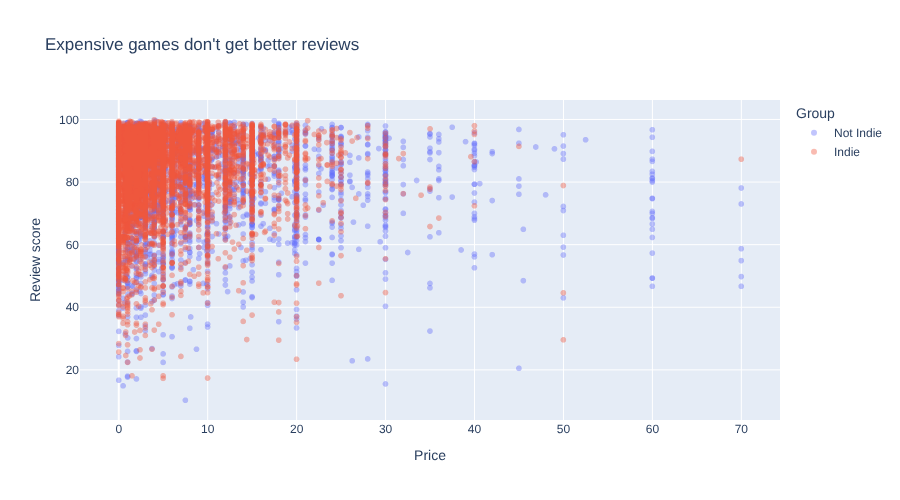

# 11. Trends and Relationships

!!! learn "In this lesson we will learn"
    - how to summarise by two columns at once
    - how to show a trend over time with a line chart
    - how to look for a relationship with a scatter plot
    - why a relationship doesn't prove that one thing causes another

!!! terms "Terminology"
    - **trend** – a change over time, such as review scores rising year after year.
    - **scatter plot** – a chart that draws one dot for each row, using one number column for x and another for y.

## Introduction

So far we've compared Indie games with other games across all years at once. But has the gap always been there, or is it new? That's a question about a **trend**: a change over time. We'll also look for a **relationship** between two number columns: do more expensive games get better reviews?

## Summarising by two columns

To see the trend, we need the median review score for each group in each year. So we'll `group_by` **two** columns at once, `Release year` and `Group`, which gives one group for every combination, such as 2018 Indie and 2018 Not Indie.

Before grouping, we'll keep only the games from 2010 to 2024. When we counted games per year, the years before 2010 had very few games, and 2025 wasn't finished. A median from a handful of games could jump around by chance, and we don't want our trend to be thrown off by that. Finally, we sort by year and then group, so the table reads in time order. Start marimo with `marimo edit steam_story.py` and press ++ctrl+shift+r++ (++cmd+shift+r++ on a Mac) to run our earlier cells. Add a new cell at the bottom, type the code below and run it.

```python linenums="1" title="steam_story.py — new cell"
--8<-- "examples/insights/11_trends_relationships/story12.py"
```

!!! primm "PRIMM"
    1. **Predict** what you think will happen when we run the cell. Be specific.
    2. **Run** the cell.
    3. Time to **investigate** the code. What does each line do?

??? note "Code explanation"
    - **line 1** → opens a bracket for our code, and will store the result in `per_year_group`.
    - **line 2** → keeps only the games released from 2010 to 2024, using `is_between`.
    - **line 3** → splits the rows into one group for each combination of `Release year` and `Group`, such as 2018 Indie and 2018 Not Indie.
    - **line 4** → finds the median review score of each group.
    - **line 5** → sorts the table by year, then by group.
    - **line 6** → closes the bracket we opened on line 1.
    - **line 7** → shows `per_year_group` as the cell's output.

The table has **30** rows: 15 years, with one row for each group in each year.

!!! tip "Why 2010 to 2024?"
    When we counted games per year, we saw that the years before 2010 have very few games, so their medians could be thrown off by a handful of games. 2025 isn't finished in our data, and has far fewer games than 2024. Leaving these years out means every point on our chart is based on plenty of games.

## Trends over time

A **line chart** joins one point to the next, which shows how something changes over time.

!!! tip "When to use a line chart"
    Use a line chart when the x-axis is **time**, such as years or months, and we want to show a **trend**: whether something is rising, falling or staying the same. Drawing one line per group lets us see whether the gap between groups has changed over time. Don't use one for groups that don't follow on from each other, like genres.

Our question is whether the gap between Indie and other games has lasted, so we need time on the x-axis and the median review score on the y-axis, with one line for each group. We'll add `markers=True` so there's a dot on each year, which makes it easy to hover over a single year and read its value. Add a new cell, type the code below and run it.

```python linenums="1" title="steam_story.py — new cell"
--8<-- "examples/insights/11_trends_relationships/story13.py"
```

!!! primm "PRIMM"
    1. **Predict** what you think will happen when we run the cell. Be specific.
    2. **Run** the cell.
    3. Time to **investigate** the code. What does each line do?
    4. Time to **modify** the code. Change `per_year_group` to `per_year`, `y` to `"Games"`, and remove the `color` line. Write a headline title for what the new chart shows.

??? note "Code explanation"
    - **line 1** → starts a line chart, using `px.line`.
    - **line 2** → uses `per_year_group` as the data.
    - **line 3** → puts the years along the x-axis.
    - **line 4** → uses the median review score for the y-axis.
    - **line 5** → draws a separate line, in a different colour, for each group.
    - **line 6** → draws a dot on each year, as well as the line, using `markers`.
    - **line 7** → sets a headline title.
    - **line 8** → closes the brackets.


This chart tells us much more than our bar chart did:

1. From 2010 to 2014, Indie games reviewed a little better.
2. In 2015 and 2016, the two lines cross: other games were slightly ahead.
3. In 2017, the Indie line moves back in front, and it stays in front every year after that.
4. From 2018, the gap grows: the Indie line stays **about 4 to 8 points** above the other line every year.

So the gap isn't a lucky average. Indie games have been ahead for eight years in a row, and that makes it a much stronger piece of evidence for our story.

!!! tip "Line charts are for time"
    A line joins each point to the next, which tells our audience "these points follow on from each other". That makes sense for years or months, but not for groups like genres. For groups, use a bar chart or a box plot instead.

## Looking for a relationship

Do more expensive games get better reviews? A **scatter plot** draws one dot for each row, using one number column for x and another for y. If the dots form a slope, the two columns are related.

!!! tip "When to use a scatter plot"
    Use a scatter plot when we have **two number columns** and want to know whether they're **related**: when one goes up, does the other tend to go up or down? Each dot is one row, so we see every game, not just a summary. Don't use one when either column is a group or a year; a bar chart or line chart suits those better.

`Price` and `Review score` are both number columns, so a scatter plot suits this question. We use `scored`, not a summary table, because we want one dot per game. We colour the dots by `Group` to see whether Indie games sit in a different place, add `hover_name="Name"` so we can find out which game a dot is, and set `opacity=0.4` because thousands of dots overlap and solid dots would hide each other. Add a new cell, type the code below and run it.

```python linenums="1" title="steam_story.py — new cell"
--8<-- "examples/insights/11_trends_relationships/story14.py"
```

!!! primm "PRIMM"
    1. **Predict** what you think will happen when we run the cell. Be specific.
    2. **Run** the cell.
    3. Time to **investigate** the code. What does each line do?

??? note "Code explanation"
    - **line 1** → starts a scatter plot, using `px.scatter`.
    - **line 2** → uses every game in `scored` as the data.
    - **line 3** → puts `Price` on the x-axis.
    - **line 4** → puts `Review score` on the y-axis.
    - **line 5** → colours each dot by its group.
    - **line 6** → shows the game's name when we hover over a dot.
    - **line 7** → makes each dot 40% solid, so we can see where lots of dots overlap.
    - **line 8** → sets the chart's title.
    - **line 9** → closes the brackets.



The dots don't slope up or down. Games at every price get scores from below 50 to almost 100. So in our data, price and review score aren't related. Hover over the dots on the right to find the most expensive games and their scores.

!!! warning "A relationship isn't a cause"
    Even when two things **are** related, it doesn't prove one causes the other. Our line chart shows that Indie games have reviewed better since 2017, but it doesn't prove that being Indie **makes** a game better. Maybe Indie players are kinder reviewers, or maybe only the best Indie games reach 500 reviews. In a data story we say "Indie games get better reviews", not "being Indie makes games better", unless we have much stronger evidence.

## Your data story

Open ***my_data_story.md***, add a new heading `## Trends and relationships` and record your answers under it.

1. If your question involves time, draw a line chart with a headline title. Record what the trend shows.
2. Choose two number columns your question uses and draw a scatter plot. Are they related?
3. Write down one other explanation for a pattern you've found, apart from the obvious one.
