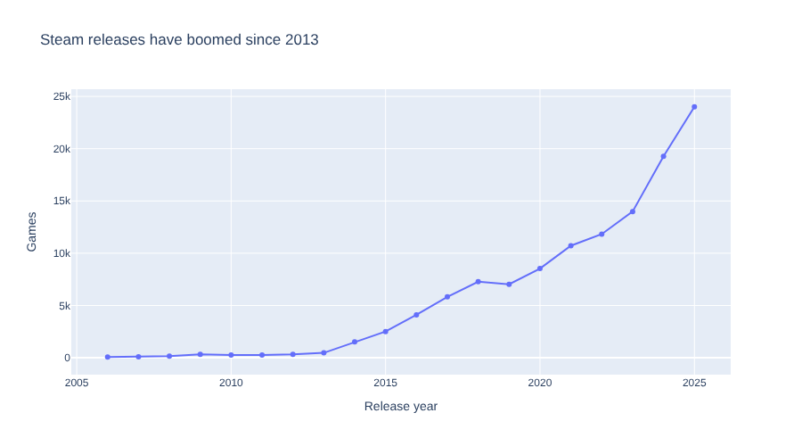
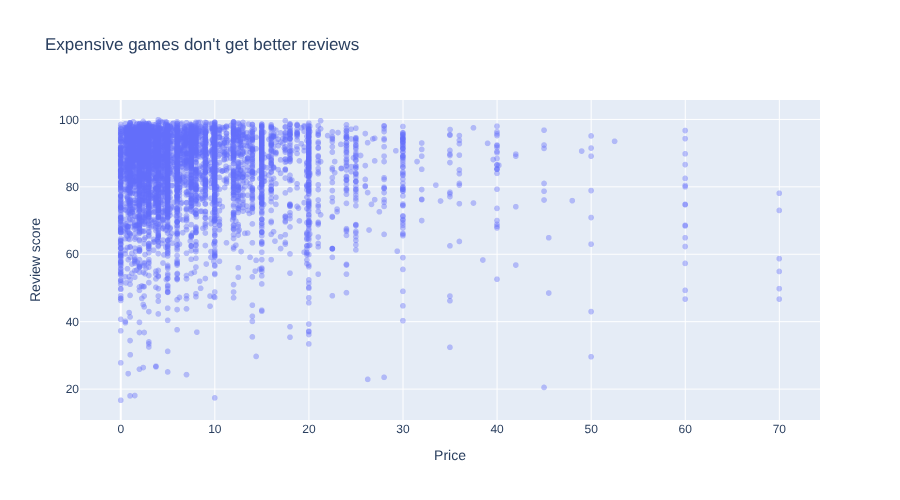

# 12. Trends, Patterns and Outliers

!!! learn "In this lesson we will learn"
    - how to show a trend over time with a line chart
    - how to look for a relationship with a scatter plot
    - why a relationship doesn't prove one thing causes another
    - how to find outliers with the interquartile range
    - how to make a simple prediction, and why to be careful with it

## Introduction

In Lesson 11 we compared groups. Now we'll look for **trends**, which are changes over time, and **patterns**, which are relationships between two columns. We'll also hunt for **outliers**: values so different from the rest that they need a closer look. Trends, patterns and outliers are often the most interesting parts of a data story.

## Trends over time

Start marimo with `marimo edit steam_story.py` and press ++ctrl+shift+r++ (++cmd+shift+r++ on a Mac) to run our earlier cells. Add a new cell, type the code below and run it.

```python linenums="1" title="steam_story.py"
--8<-- "examples/insights/12_trends_outliers/story10.py"
```

!!! primm "PRIMM"
    1. **Predict** what you think will happen when we run the cell. Be specific.
    2. **Run** the cell.
    3. Time to **investigate** the code. What does each line do?
    4. Time to **modify** the code. Change `y="Games"` to `y="Median price"` and write a new headline title for what it shows.

??? note "Code explanation"
    - **line 1** → keeps only the years from 2006 to 2025 in `per_year`, and stores them in `full_years`.
    - **line 2** → starts a line chart, using `px.line`.
    - **line 3** → uses `full_years` as the data.
    - **line 4** → puts the years along the x-axis.
    - **line 5** → uses the number of games for the y-axis.
    - **line 6** → draws a dot on each year, as well as the line, using `markers`.
    - **line 7** → sets the chart's title.
    - **line 8** → closes the brackets.



We left out the years before 2006, which only have a handful of games each, and 2026, which isn't finished. What's left shows a clear trend: fewer than 500 new games a year until 2013, then a boom, with **24,007** in 2025. Around this time, Steam started letting far more developers sell their games, first through Steam Greenlight in 2012 and then Steam Direct in 2017.

!!! tip "Line charts are for time"
    A line joins each point to the next, which tells our audience "these points follow on from each other". That makes sense for years or months, but not for genres or price bands. For groups, use a bar chart instead.

## Looking for a relationship

Do more expensive games get better reviews? A **scatter plot** draws one dot for each row, using one number column for x and another for y. If the dots form a slope, the two columns are related. Add a new cell, type the code below and run it.

```python linenums="1" title="steam_story.py"
--8<-- "examples/insights/12_trends_outliers/story11.py"
```

!!! primm "PRIMM"
    1. **Predict** what you think will happen when we run the cell. Be specific.
    2. **Run** the cell.
    3. Time to **investigate** the code. What does each line do?

??? note "Code explanation"
    - **line 1** → starts a scatter plot, using `px.scatter`.
    - **line 2** → uses only games with at least 1,000 recommendations, so every review score is reliable.
    - **line 3** → puts `Price` on the x-axis.
    - **line 4** → puts `Review score` on the y-axis.
    - **line 5** → shows the game's name when we hover over a dot.
    - **line 6** → makes each dot 40% solid, so we can see where lots of dots overlap.
    - **line 7** → sets the chart's title.
    - **line 8** → closes the brackets.



The dots don't slope up or down. Games at every price get scores from the 40s to almost 100. So the answer is no: in our data, price and review score aren't related. Hover over the dots to find the most expensive games and their scores.

!!! warning "A relationship isn't a cause"
    Even when two columns **are** related, it doesn't prove one causes the other. If expensive games did get better reviews, it might be because big studios make expensive games **and** have more money to make good ones. The price itself wouldn't be the reason. In a data story we say "is related to" or "goes with", not "causes", unless we have much stronger evidence.

## Finding outliers

An **outlier** is a value far away from most of the others. One common way to find them uses the **interquartile range**, or **IQR**:

1. find the 25% value, **Q1**, and the 75% value, **Q3**
2. the IQR is the distance between them: **Q3 − Q1**
3. any value more than **1.5 × IQR** above Q3 is an outlier

This is the same rule Plotly used to draw the dots on our box plots in Lesson 11. Add a new cell, type the code below and run it.

```python linenums="1" title="steam_story.py"
--8<-- "examples/insights/12_trends_outliers/story12.py"
```

!!! primm "PRIMM"
    1. **Predict** what you think will happen when we run the cell. Be specific.
    2. **Run** the cell.
    3. Time to **investigate** the code. What does each line do?
    4. Time to **modify** the code. Add a new cell that shows `price_outliers` sorted by `Price`, most expensive first. Are the top few really games?

??? note "Code explanation"
    - **line 1** → finds the 25% value of `Price`, using `quantile(0.25)`, and stores it in `q1`.
    - **line 2** → finds the 75% value and stores it in `q3`.
    - **line 3** → works out the **upper fence**: Q3 plus 1.5 times the IQR.
    - **line 4** → keeps only the games that cost more than the upper fence, and stores them in `price_outliers`.
    - **line 5** → shows the upper fence, rounded to 2 decimal places, and the number of outliers.

The output is **(13.96, 9491)**. Q1 is $0.68 and Q3 is $5.99, so any game over $13.96 counts as an outlier: 9,491 games.

That's far too many to all be mistakes. Most of them are ordinary games that cost $20 or $40. They're outliers only because most Steam games are so cheap. The IQR rule tells us which values to **look at**, not which ones to delete. The very top of the list is different: the few items that cost $999.99 aren't typical games at all. Whether to keep them depends on our question.

## Making a prediction

Our line chart shows growth. Can we use it to predict how many games will come out in 2026? Add a new cell, type the code below and run it.

```python linenums="1" title="steam_story.py"
--8<-- "examples/insights/12_trends_outliers/story13.py"
```

!!! primm "PRIMM"
    1. **Predict** what you think will happen when we run the cell. Be specific.
    2. **Run** the cell.
    3. Time to **investigate** the code. What does each line do?

??? note "Code explanation"
    - **line 1** → keeps only the years from 2020 onwards in `full_years`, and stores them in `recent`.
    - **line 2** → works out how much the number of games changed from each year to the next, using `diff`, then finds the average change.
    - **line 3** → adds the average change to the last year's count, using `[-1]` to get the last value, to predict 2026.
    - **line 4** → shows the average growth and the prediction, rounded to whole numbers.

The output is **(3095, 27102)**. From 2020 to 2025, about 3,095 more games came out each year than the year before, so we predict about **27,102** games in 2026.

!!! warning "Predictions are guesses with reasons"
    Our prediction assumes the next year will grow like the last five. That might not happen: a change to Steam's rules, or a new kind of AI tool for making games, could change everything. When we put a prediction in our story, we say what it's based on. And we can check it: by the time we're using this course, 2026 is over. Look up how many games really came out on Steam in 2026. How close were we?

## Our data story

Open ***my_data_story.md***, add a new heading `## Lesson 12: Trends and outliers` and record our answers under it.

1. Draw a line chart or a scatter plot for our question, with a headline title. Record the title and what the chart shows.
2. Find the outliers in one number column our question uses. Record how many there are, and decide whether to keep them. Write down why.
3. If our question is about change over time, make a prediction and write down what it's based on.
