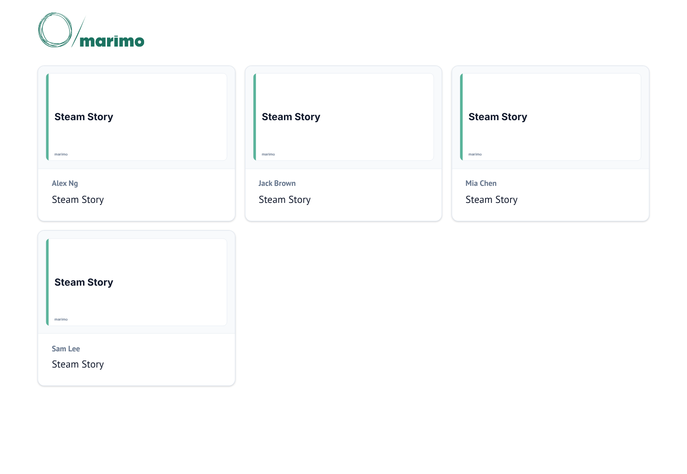

# Hosting on a Class Server

!!! learn "On this page we will learn"
    - why the class's stories run on a class server
    - how to set up a laptop or Raspberry Pi as the class server
    - how to add each student's story and check that it works
    - how to keep the class server safe

This page is for teachers. In [Publishing Our Data Story](../resolution/15_publishing.md), students hand in ***steam_story.py*** and ***data/clean_games.parquet***. The class server runs every student's notebook in app view, so anyone on the school network can open any story in a web browser, with the code hidden and the sliders and dropdowns working.

## Why a class server?

marimo notebooks need Python running somewhere. We looked at two other ways of publishing them:

- **a plain HTML export** works on any website, such as GitHub Pages, but the UI elements from [The Aha Moment](../aha/14_aha_moment.md) stop working
- **a WebAssembly export** runs Python inside the visitor's browser, so the UI elements work, but in testing it took more than four minutes to show anything, because each visitor's browser has to download Python, Polars and Plotly first

On a class server, Python runs on one computer at school, so each story opens in a few seconds and everything works. It's also light: in testing, the server used about 190 MB of memory, plus about 20 MB for each extra person viewing a story, so a laptop or a Raspberry Pi 4 or 5 can host a whole class.

## What we need

- a laptop or a Raspberry Pi 4 or 5 running the **64-bit** Raspberry Pi OS, connected to the school network
- Python 3.10 or newer
- every student's ***steam_story.py*** and ***clean_games.parquet***
- permission from the school's IT team to run a web server on the school network

## Set up the class server

1. Create a folder called ***class_server***, with a folder called ***stories*** inside it.
    - **Why:** ***stories*** will hold one folder for each student's story.
    - **Expected result:** an empty ***class_server/stories*** folder.
2. Open a terminal in the ***class_server*** folder and create a virtual environment.

    === "Windows"

        ```text
        python -m venv .venv
        .venv\Scripts\activate
        ```

    === "Raspberry Pi OS"

        ```text
        python3 -m venv .venv
        source .venv/bin/activate
        ```

    - **Why:** the class server gets its own copy of the libraries, the same versions the students use.
    - **Expected result:** the prompt starts with `(.venv)`.
3. Install the same libraries the students use.

    ```text
    pip install marimo polars==2.0.0rc2 plotly numpy
    ```

    - **Why:** the class server runs the students' code, so it needs every library the notebooks import.
    - **Expected result:** a line starting `Successfully installed`.

## Add the students' stories

Put each student's files in their own folder inside ***stories***. Use the student's name for the folder, because marimo labels each story's card with it: a folder called `sam_lee` shows as **Sam Lee**. For example:

```text
class_server/
    .venv/
    stories/
        sam_lee/
            steam_story.py
            data/
                clean_games.parquet
        alex_ng/
            steam_story.py
            data/
                clean_games.parquet
```

!!! warning "Check each notebook before adding it"
    The class server runs the students' code with the permissions of whoever started it, so a notebook could read or delete files on that computer. Before adding a notebook, open ***steam_story.py*** and skim it. The notebooks in this course only need `marimo`, `plotly.express` and `polars`. Look closely at any notebook that imports anything else, such as `os`, `shutil`, `subprocess` or `requests`, or that opens or writes files other than ***clean_games.parquet***.

## Start the class server

1. In the terminal, in the ***class_server*** folder, type the command below and press ++enter++.

    ```text
    marimo run stories --host 0.0.0.0 --port 2718 --headless
    ```

    - **Why:** `marimo run stories` serves every notebook in the ***stories*** folder in app view. `--host 0.0.0.0` lets other computers on the network connect, `--port 2718` sets the port, and `--headless` stops marimo opening a browser on the server.
    - **Expected result:** the terminal shows marimo's URL and keeps running. On Windows, a firewall message may ask whether Python can use the network: allow it on **private** networks only, or ask IT if the school network doesn't count as private.
2. Find the server's IP address.

    === "Windows"

        Open a second terminal and type `ipconfig`. The address is the **IPv4 Address** of the Wi-Fi or Ethernet adapter, such as `192.168.1.50`.

    === "Raspberry Pi OS"

        Open a second terminal and type `hostname -I`. The first number is the address, such as `192.168.1.50`.

    - **Why:** students need the address to open the class server.
    - **Expected result:** an address made of four numbers separated by dots.
3. On another computer, open a web browser and go to `http://<address>:2718`, such as `http://192.168.1.50:2718`.
    - **Why:** this checks that other computers can reach the class server.
    - **Expected result:** marimo's home page, with a card for each student's story.



## Check each story

Open each story from the home page and scroll to the end. A story that works shows its title, text and charts within a few seconds.

If a story shows an empty page, look at the terminal running the class server. The usual cause is:

``` { .text .error linenums="1" }
FileNotFoundError: No such file or directory (os error 2): data/clean_games.parquet
```

- **line 1** → the notebook still loads its data with the path `"data/clean_games.parquet"`, which only works when marimo starts in the student's own folder. The student needs to make the `mo.notebook_dir()` change from [Publishing Our Data Story](../resolution/15_publishing.md#getting-ready-for-the-class-server), or their ***clean_games.parquet*** isn't inside a ***data*** folder.

## Update the stories

- **A changed notebook:** replace the student's files. The next time anyone opens or reloads that story, they get the new version.
- **A new student folder:** marimo only finds new folders when it starts. Stop the class server with ++ctrl+c++ and start it again with the same command.

## Start the class server automatically (Raspberry Pi)

On a Raspberry Pi, we can make the class server start every time the Pi turns on. The steps below assume the ***class_server*** folder is in the home folder of a user called `stories`.

1. Create a user just for the class server.

    ```text
    sudo adduser stories
    ```

    - **Why:** the students' code runs as this user, which can't change system files or read other users' files.
    - **Expected result:** the Pi asks for a password and some details, then creates the user. Set up ***/home/stories/class_server*** as that user, following the steps above.
2. Create a service file.

    ```text
    sudo nano /etc/systemd/system/class-server.service
    ```

    Type the text below, then press ++ctrl+o++, ++enter++ and ++ctrl+x++ to save and close.

    ```text title="class-server.service"
    [Unit]
    Description=Steam Data Stories class server
    After=network-online.target
    Wants=network-online.target

    [Service]
    User=stories
    WorkingDirectory=/home/stories/class_server
    ExecStart=/home/stories/class_server/.venv/bin/marimo run stories --host 0.0.0.0 --port 2718 --headless
    Restart=on-failure

    [Install]
    WantedBy=multi-user.target
    ```

    - **Why:** the service file tells the Pi how to start the class server, which user runs it, and to restart it if it crashes.
    - **Expected result:** the file is saved.
3. Turn on the service and start it.

    ```text
    sudo systemctl enable --now class-server
    ```

    - **Why:** `enable` starts the class server whenever the Pi turns on, and `--now` starts it straight away.
    - **Expected result:** no message. `sudo systemctl status class-server` shows **active (running)**.

To pick up new student folders, restart the service with `sudo systemctl restart class-server`.

## Keeping it safe

- Only run the class server on the school network. Don't make it reachable from the internet.
- Run it as a user that has no access to anything important. On a laptop, that means a separate standard (non-administrator) account, not our own teaching account.
- Check every notebook before adding it, as described above.
- Stop the class server when the presentations and marking are finished.
