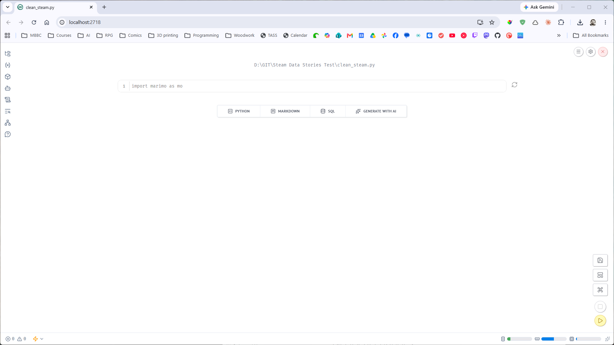

# Setting Up

!!! learn "On this page we will learn"
    - how to install Python and VS Code
    - how to create a project folder and a virtual environment
    - how to install Polars, Plotly and marimo
    - how to download the Steam data
    - how to open our first marimo notebook

!!! terms "Terminology"
    - **release candidate** – a version of a program that's almost finished and being tested before its official release.
    - **PowerShell** – the program VS Code uses for its terminal on Windows unless we choose another one.
    - **Command Prompt** – an older Windows terminal program that can switch on a virtual environment without running a PowerShell script.

We'll do all our work in a project folder on our own computer, using **VS Code** to manage our files and **marimo** to write our code. Before we start, we need to install the tools, download the data and check everything works. Follow each step in order.

Most steps are the same on Windows and macOS. Where they're different, the page has a tab for each, so click the tab for our computer.

## Install Python and VS Code

If Python and VS Code are already on our computer, skip to [Create the project folder](#create-the-project-folder).

1. Download and install Python from [python.org](https://www.python.org/downloads/){ target="_blank" rel="noopener" }. All our code is Python, and the libraries we use are Python libraries.

    === "Windows"

        - Choose the installer that matches our computer's processor. Open **Settings** → **System** → **About** and look at **System type**:
            - **x64-based processor** → download **Windows installer (64-bit)**
            - **ARM-based processor** → download **Windows installer (ARM64)**
        - On the first screen of the installer, tick **Add python.exe to PATH**, then click **Install Now**. The installer finishes with "Setup was successful".

    === "macOS"

        - Download the **macOS 64-bit universal2 installer**, open the ***.pkg*** file and click **Continue** through each screen. The installer finishes with "The installation was successful" and a ***Python*** folder opens in Finder, which we can close.

2. Download and install VS Code from [code.visualstudio.com](https://code.visualstudio.com/){ target="_blank" rel="noopener" }. On Windows, if our **System type** says **ARM-based processor**, choose the **Arm64** download. On a Mac, drag **Visual Studio Code** into the ***Applications*** folder so it's easy to find.
3. In VS Code, click the **Extensions** icon in the left bar, search for **Python** and install the extension by Microsoft. The extension lets VS Code create and use virtual environments.

## Create the project folder

1. Create a new folder called ***steam_data_stories*** somewhere easy to find, such as our ***Documents*** folder. Our data and both of our notebooks will live in this folder.
2. In VS Code, choose **File** → **Open Folder…** and open the ***steam_data_stories*** folder. If VS Code asks whether we trust the authors of the files, choose **Yes**. The Explorer panel on the left now shows **STEAM_DATA_STORIES** with no files.

## Create a virtual environment

A **virtual environment** is a private copy of Python just for this project. The libraries we install go into the virtual environment rather than into the computer's main Python, so different projects can't interfere with each other.

1. Press ++ctrl+shift+p++ (++cmd+shift+p++ on a Mac), type **Python: Create Environment** and press ++enter++. Choose **Venv**, then choose the Python version we installed. After a few seconds a ***.venv*** folder appears in the Explorer panel.
2. Choose **Terminal** → **New Terminal**. A terminal opens at the bottom of VS Code, and its prompt starts with `(.venv)`, which means the virtual environment is switched on.

!!! warning "No (.venv) in the terminal"
    If the prompt doesn't start with `(.venv)`, close the terminal with the bin icon and open a new one. Libraries installed without `(.venv)` go into the wrong Python, and marimo won't be able to find them.

### Running scripts is disabled (Windows)

On some Windows computers, the new terminal shows an error like this instead of the `(.venv)` prompt:

``` { .text .error linenums="1" }
Activate.ps1 cannot be loaded because running scripts is disabled
```

- **line 1** → ***Activate.ps1*** is the script that switches on our virtual environment in **PowerShell**, the terminal VS Code uses on Windows. The computer's settings don't allow PowerShell to run scripts, so the virtual environment stays switched off.

We don't need to change the computer's settings. Instead, we'll tell VS Code to use **Command Prompt**, which switches on the virtual environment without a PowerShell script.

1. Press ++ctrl+shift+p++, type **Terminal: Select Default Profile** and press ++enter++. Choose **Command Prompt**. Every new terminal will now open as Command Prompt instead of PowerShell.
2. Close the terminal with the bin icon, then choose **Terminal** → **New Terminal**. The new prompt starts with `(.venv)` and ends with the path to our ***steam_data_stories*** folder and a `>`.

## Install the libraries

1. In the terminal, type the command below and press ++enter++. It installs marimo (our notebook), Polars (for working with tables of data), Plotly (for charts) and NumPy (which Plotly needs to draw charts from Polars data). When it finishes, the last line starts with `Successfully installed`.

    ```text
    pip install marimo polars==2.0.0rc2 plotly numpy
    ```

2. Check marimo installed correctly by typing the command below. It shows a version number such as `0.25.1`. Ours might be a little different.

    ```text
    marimo --version
    ```

!!! tip "Why polars==2.0.0rc2?"
    The `==2.0.0rc2` part asks for one exact version of Polars. **rc** stands for **release candidate**: a version that's almost finished and being tested before its official release. Polars 2.0 changes a few commands, and this course uses the new versions, so we all need the same one.

## Download the data

Our notebooks will look for the data in a folder called ***data*** inside our project.

1. In VS Code's Explorer panel, hover over **STEAM_DATA_STORIES**, click the **New Folder** icon and name the folder `data`.
2. Download both data files: [steam_games.csv](../downloads/steam_games.csv){ download="steam_games.csv" } and [README.txt](../downloads/README.txt){ download="README.txt" }. ***steam_games.csv*** is our classroom copy of the Steam data, and ***README.txt*** explains where the data came from and includes its licence.
3. Open our ***Downloads*** folder in File Explorer (Finder on a Mac), then drag both files onto the ***data*** folder in VS Code's Explorer panel. If VS Code asks whether to copy or move them, choose **Copy**.

!!! warning "Check the file names"
    If we download a file more than once, the browser may rename it, such as ***steam_games (1).csv***. Our code looks for ***steam_games.csv*** exactly, so rename the file or delete the extra copy.

Our project folder should now look like this:

```text
steam_data_stories/
    .venv/
    data/
        README.txt
        steam_games.csv
```

!!! warning "Don't change steam_games.csv"
    ***steam_games.csv*** is our original data. If we open it in Excel or Numbers and save it, the program can quietly change values, such as turning dates into a different format. We'll only ever read it with code, starting when we explore our data, and save our cleaned data as a new file.

## Open our first notebook

1. In the terminal, type the command below and press ++enter++. It starts marimo and creates a new notebook called ***clean_steam.py***, which we'll use to explore and clean our data.

    ```text
    marimo edit clean_steam.py
    ```

    The terminal shows "Edit clean_steam.py in your browser" with a web address, and a new tab opens in our web browser with an empty marimo notebook.

    

2. Back in VS Code, click in the terminal and press ++ctrl+c++ (also ++ctrl+c++ on a Mac, not ++cmd+c++). When marimo asks "Are you sure you want to quit? (y/N)", type `y` and press ++enter++. marimo asks first so we don't stop it by accident. The terminal shows the `(.venv)` prompt again.

!!! warning "Keep the terminal open"
    The marimo notebook in our browser only works while marimo is running in the VS Code terminal. If we close the terminal or press ++ctrl+c++ (on Windows and macOS), the notebook stops working. On a Mac, closing the VS Code window or quitting VS Code with ++cmd+q++ also closes the terminal and stops marimo. Our code is saved in ***clean_steam.py***, so we can start marimo again with the same command and carry on.

Our computer is ready. Next, we'll find out what makes a good data story.
